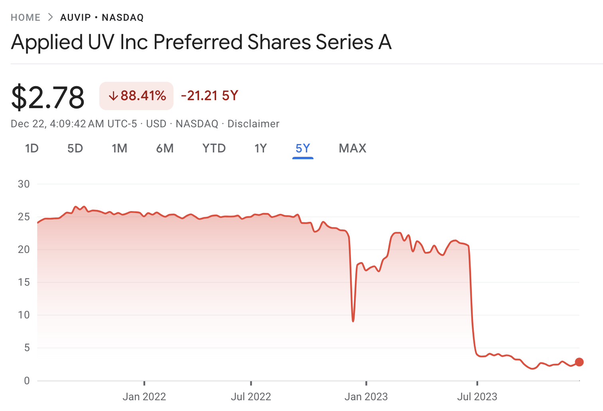
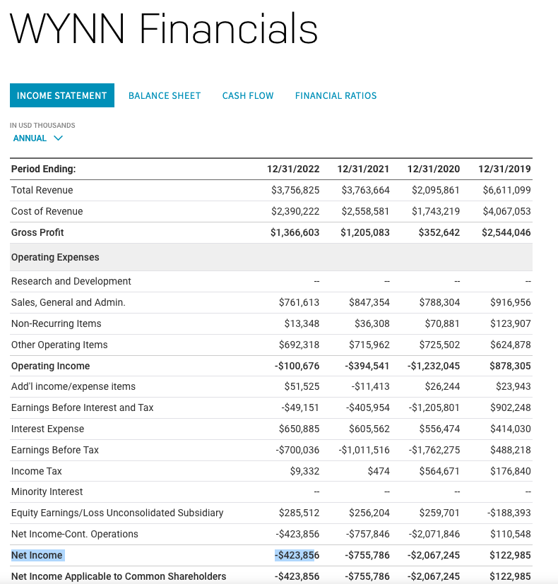

1. Introduction
    1. Context
    1. Significance
    1. Expected Outcomes
1. Data Acquisition and Preparation
    1. Data Acquisition
    1. Preparation
1. Pre-Processing
1. Methodology
    1. Dataset Metrics
    1. Defining the Dividends Threshold
1. Conclusion
1. References

# Introduction

<p style="text-align: justify;text-justify: inter-word;">
In the context of investment analysis,  there are diverse methodologies for investors to compare stocks to identify which stocks are more attractive than others. Among these methods, a reliable approach involves assessing a company's attractiveness by evaluating its dividend payout ratio and dividend yield over a specific timeframe. In this coursework, our focus lies in presenting an analytical framework to compare and identify attractive companies by using the dividend yield and the dividend payout ratio. The stocks under examination are constituents of the NASDAQ index and have disbursed dividends during the year 2023.
</p>

## Context

<p style="text-align: justify;text-justify: inter-word;">
Throughout this coursework, we will assess companies across diverse sectors, encompassing basic materials, energy, financials, healthcare, among others, that are constituents of the NASDAQ index. As highlighted by the CFI Team (2023), the NASDAQ stands as a prominent U.S.-based stock market exchange, ranking as the second-largest globally in terms of market capitalization. This coursework will primarily concentrate on companies that distributed dividends in 2023, as it is widely acknowledged that  "paying dividends is more common among mature and well-established companies" (Gunnars & Wood, 2023).</p>

<p style="text-align: justify;text-justify: inter-word;">According to Gunnars & Wood (2023), dividends represent monetary distributions made by companies to their shareholders, typically issued as a fixed amount per share. While dividends are primarily disbursed in cash, there are instances where they can take other forms, such as additional shares of stock. "The stability of dividends serves as a significant metric, as companies generally refrain from reducing or eliminating these payouts unless facing financial hardship. It's noteworthy that announcements of dividend cuts often lead to substantial declines in stock prices" (Gunnars & Wood, 2023). Throughout this coursework, key dividend metrics like dividend yield and payout ratio will be employed to assess the attractiveness of stocks and determine the sustainability of the dividends disbursed.</p>


<p style="text-align: justify;text-justify: inter-word;">As per Fernando (2023), the dividend yield can be expressed as a percentage, and it is a financial ratio (dividend/price) that shows how much a company pays out in dividends each year relative to its stock price. The dividend yield metric is a core financial ratio, particularly as investors continue to seek income and assess the relative attractiveness of different stocks based on their dividend-paying capacity. The dividend yield formula is as follows:</p>

$$
Dividend Yield = Price Per Share / Annual Dividends Per Share
$$

<p style="text-align: justify;text-justify: inter-word;">According to the Investopedia team (2023), different from the dividend yield ratio the dividend payout ratio gives investors an idea of how much money it returns to its shareholders compared to how much it keeps on hand to reinvest in growth, pay off debt, or add to cash reserves. The payout ratio indicates the percentage of total net income paid out in the form of dividends. From the payout ratio, we can derive the retention ratio which shows the percentage of net income retained by a company after dividend payments, while the payout ratio indicates the percentage of total net income paid out in the form of dividends. The dividend payout and retention formulas are as follows:</p>

$$
Dividend Payout Ratio = Dividends Paid / Net Income
$$

$$
Retention Ratio = 1 - Dividend Payout Ratio
$$

## Significance

<p style="text-align: justify;text-justify: inter-word;">Accordenly to Rinehart et al. (2022), in a world of low-interest rates, equity income investing provides a means by which investors can generate real income growth in portfolios to meet current and future income needs. Throughout analyzing dividends holds substantial significance for investors as it offers critical insights into a company's financial health and future prospects. Dividends serve as a key indicator of a company's stability and ability to generate consistent profits. A history of regular dividend payments, ideally coupled with increases over time, often signifies financial strength and management's confidence in sustained earnings. Moreover, dividends provide a tangible return on investment, offering investors a source of income irrespective of market fluctuations. Examining dividend policies and payout ratios enables investors to gauge management's strategies regarding capital allocation, growth plans, and overall profitability. For income-focused investors, dividends can represent a vital component of their investment strategy, providing steady cash flow. However, it's essential to note that high dividend yields or payout ratios might not always guarantee a sound investment, as these metrics should be evaluated alongside other financial indicators and the company's overall performance and prospects.</p>

## Expected Outcomes

<p style="text-align: justify;text-justify: inter-word;">Through this experiment, we aim to establish an analytical method to evaluate the appeal of companies based on their dividend disbursements using different dividend metrics. We intend to compare these findings from the entirety of NASDAQ index companies with the metrics specific to each sector. This comparative analysis seeks to provide insights into identifying attractive companies based on their dividend practices.</p>


# Data Acquisition and Preparation

<p style="text-align: justify;text-justify: inter-word;">Along this coursework, authentic data was exclusively sourced from various platforms, including Nasdaq Trader and the Nasdaq Rest APIs. The acquisition of this data involved employing web scraping techniques. "Web scraping is the process of collecting and parsing raw data from the Web" (Amos, 2023). Considering the varied sources of this data, amalgamating them into a unified dataset was imperative to ensure proper processing. The preparation of this dataset entailed extracting the specific sample needed to effectively execute the proposed framework.</p>

<p style="text-align: justify;text-justify: inter-word;">The data acquisition and preparation processes collectively require more than an hour for execution. To streamline the experiment, the resultant datasets—nasdaq-dataset, nasdaq-dividends, nasdaq-sectors, and nasdaq-symbols—from the data acquisition phase will be shared alongside this paper. Due to the time-consuming nature of these processes, the data acquisition was segmented into three parts (symbols, sectors, and dividends acquisition) to mitigate potential connection issues. This segmentation allows for minimizing the impact of errors; for instance, if issues arise during dividends acquisition, there is no need to re-execute the initial two steps. For ongoing validation or execution of the experiment with the most recent data, the pre-generated datasets can be deleted, as they will automatically regenerate during the subsequent execution.</p>


## Data Acquisition

<p style="text-align: justify;text-justify: inter-word;">In order to create a single dataset to assess the attractiveness of a stock, the following data acquisition steps are necessary:</p>

- Extract the list of negotiable companies in the NASDAQ index
- Derive the sector from each negotiable stock
- Derive the dividend metrics to each stock

<p style="text-align: justify;text-justify: inter-word;">On the Nasdaq Trader website, it's available a CSV file with all the negotiable stocks in NASDAQ. The provided CSV contains 5022 rows, with the final row denoting the timestamp indicating the file's creation time. Among these entries, 8 rows are dedicated to tests and are identified through the "Test Issue" column. Currently, 5013 companies were at some moment negotiable within the NASDAQ index. From these 5013 companies, 592 are classified as ETFs, discerned by the boolean column "ETF".</p>

<p style="text-align: justify;text-justify: inter-word;">During the derivation of the sectors, only current negotiable companies will be returned from the Nasdaq company profile API, and with this information, we can identify the non-active companies. The company profile API will provide the following attributes: company name, address, phone number, industry, sector, region, key executives, and the company URL. From these attributes, we are only interested in the sectors, the remaining info is discarded. Currently, only 4136 companies are active from the original list with 5013 companies. The company profile information is extracted by a GET method: https://api.nasdaq.com/api/company/AAPL/company-profile.</p>

<p style="text-align: justify;text-justify: inter-word;">The derivation of the dividends are from the Nasdaq dividends API. The dividends API will provide the following attributes: ex-dividend date, dividend yield, annual dividend, payout ratio, and the dividends history. From these attributes, we are interested in the following fields: dividend yield, annual dividend, payout ratio, and dividend history. Of the 4136 active companies, only 947 companies already distributed dividends. The company dividend hystory is extracted by a GET method: https://api.nasdaq.com/api/quote/AAPL/dividends?assetclass=stocks.</p>


```python
#required libraries to run the expirement
import numpy as np
import matplotlib.pyplot as plt
import os.path
import pandas as pd
import requests
import time


from bs4 import BeautifulSoup
from json import loads
```


```python
#webscrapping function based on the BeautifulSoup
def get_soup(URL, jar=None):
    request_headers = {
        "Upgrade-Insecure-Requests": "1",
        "User-Agent": "Mozilla/5.0 (Macintosh; Intel Mac OS X 10_15_7) AppleWebKit/537.36 (KHTML, like Gecko) Chrome/119.0.0.0 Safari/537.36",
        "Accept": "text/html,application/xhtml+xml,application/xml;q=0.9,image/avif,image/webp,image/apng,*/*;q=0.8,application/signed-exchange;v=b3;q=0.7",
        "Accept-Language": "en-US,en;q=0.9",
        "Accept-Encondig": "gzip, deflate, br",
    }
    if jar:
        response = requests.get(URL, cookies=jar, headers= request_headers)
    else:
        response = requests.get(URL, headers= request_headers)
        jar = requests.cookies.RequestsCookieJar()
    print(response.url)
    data = response.text
    soup = BeautifulSoup(data, "html.parser")
    return soup, jar
```


```python
#Create a dataframe from all NASDAQ stocks with the Symbol and Company name (downloaded from https://www.nasdaqtrader.com/dynamic/symdir/nasdaqlisted.txt)
def nasdaq_create_symbols():
    nasdaqlisted = pd.read_csv("data/nasdaqlisted.csv", sep="|")
    nasdaqlisted = nasdaqlisted.drop(5022) # Removing summary row
    nasdaqlisted = nasdaqlisted[nasdaqlisted["Test Issue"] == "N"]
    
    nasdaq_symbols = nasdaqlisted[["Symbol", "Security Name"]]
    nasdaq_symbols = nasdaq_symbols.rename(columns={"Security Name": "Company Name"})
    nasdaq_symbols.to_csv("data/nasdaq-symbols.csv", index=False)
```


```python
#Dataframe with all negotiable NASDAQ stocks
pd.read_csv("data/nasdaqlisted.csv", sep="|")
```


<div>
<style scoped>
    .dataframe tbody tr th:only-of-type {
        vertical-align: middle;
    }

    .dataframe tbody tr th {
        vertical-align: top;
    }

    .dataframe thead th {
        text-align: right;
    }
</style>
<table border="1" class="dataframe">
  <thead>
    <tr style="text-align: right;">
      <th></th>
      <th>Symbol</th>
      <th>Security Name</th>
      <th>Market Category</th>
      <th>Test Issue</th>
      <th>Financial Status</th>
      <th>Round Lot Size</th>
      <th>ETF</th>
      <th>NextShares</th>
    </tr>
  </thead>
  <tbody>
    <tr>
      <th>0</th>
      <td>AACG</td>
      <td>ATA Creativity Global - American Depositary Sh...</td>
      <td>G</td>
      <td>N</td>
      <td>N</td>
      <td>100.0</td>
      <td>N</td>
      <td>N</td>
    </tr>
    <tr>
      <th>1</th>
      <td>AACI</td>
      <td>Armada Acquisition Corp. I - Common Stock</td>
      <td>G</td>
      <td>N</td>
      <td>N</td>
      <td>100.0</td>
      <td>N</td>
      <td>N</td>
    </tr>
    <tr>
      <th>2</th>
      <td>AACIU</td>
      <td>Armada Acquisition Corp. I - Unit</td>
      <td>G</td>
      <td>N</td>
      <td>N</td>
      <td>100.0</td>
      <td>N</td>
      <td>N</td>
    </tr>
    <tr>
      <th>3</th>
      <td>AACIW</td>
      <td>Armada Acquisition Corp. I - Warrant</td>
      <td>G</td>
      <td>N</td>
      <td>N</td>
      <td>100.0</td>
      <td>N</td>
      <td>N</td>
    </tr>
    <tr>
      <th>4</th>
      <td>AADI</td>
      <td>Aadi Bioscience, Inc. - Common Stock</td>
      <td>S</td>
      <td>N</td>
      <td>N</td>
      <td>100.0</td>
      <td>N</td>
      <td>N</td>
    </tr>
    <tr>
      <th>...</th>
      <td>...</td>
      <td>...</td>
      <td>...</td>
      <td>...</td>
      <td>...</td>
      <td>...</td>
      <td>...</td>
      <td>...</td>
    </tr>
    <tr>
      <th>5018</th>
      <td>ZXYZ.A</td>
      <td>Nasdaq Symbology Test Common Stock</td>
      <td>Q</td>
      <td>Y</td>
      <td>N</td>
      <td>100.0</td>
      <td>NaN</td>
      <td>N</td>
    </tr>
    <tr>
      <th>5019</th>
      <td>ZXZZT</td>
      <td>NASDAQ TEST STOCK</td>
      <td>G</td>
      <td>Y</td>
      <td>N</td>
      <td>100.0</td>
      <td>NaN</td>
      <td>N</td>
    </tr>
    <tr>
      <th>5020</th>
      <td>ZYME</td>
      <td>Zymeworks Inc. - Common Stock</td>
      <td>Q</td>
      <td>N</td>
      <td>N</td>
      <td>100.0</td>
      <td>N</td>
      <td>N</td>
    </tr>
    <tr>
      <th>5021</th>
      <td>ZYXI</td>
      <td>Zynex, Inc. - Common Stock</td>
      <td>Q</td>
      <td>N</td>
      <td>N</td>
      <td>100.0</td>
      <td>N</td>
      <td>N</td>
    </tr>
    <tr>
      <th>5022</th>
      <td>File Creation Time: 1219202306:00</td>
      <td>NaN</td>
      <td>NaN</td>
      <td>NaN</td>
      <td>NaN</td>
      <td>NaN</td>
      <td>NaN</td>
      <td>NaN</td>
    </tr>
  </tbody>
</table>
<p>5023 rows × 8 columns</p>
</div>


```python
#Derive the sectors from https://api.nasdaq.com/api/company/AAPL/company-profile in case of failure it means the company is not being commercialized
def nasdaq_create_sectors():
    nasdaq_sectors = pd.read_csv("data/nasdaq-symbols.csv")
    sectors = []
    for symbol in nasdaq_sectors["Symbol"]:
        response = get_soup(f"https://api.nasdaq.com/api/company/{symbol}/company-profile")
        try:
            response = loads(response[0].text)
            if (response["status"]["rCode"] == 200 and response["data"] != None):
                sectors.append(response["data"]["Sector"]["value"])
            else:
                print(f"Symbol {symbol} is not active")
                sectors.append(None)
        except Exception:
            print(f"Error retriving the symbol {symbol}")
            sectors.append(None)
        time.sleep(0.5)
    nasdaq_sectors["Sector"] = sectors
    nasdaq_sectors.to_csv("data/nasdaq-sectors.csv", index=False)
```


```python
pd.read_csv("data/nasdaq-sectors.csv")
```


<div>
<style scoped>
    .dataframe tbody tr th:only-of-type {
        vertical-align: middle;
    }

    .dataframe tbody tr th {
        vertical-align: top;
    }

    .dataframe thead th {
        text-align: right;
    }
</style>
<table border="1" class="dataframe">
  <thead>
    <tr style="text-align: right;">
      <th></th>
      <th>Symbol</th>
      <th>Company Name</th>
      <th>Sector</th>
    </tr>
  </thead>
  <tbody>
    <tr>
      <th>0</th>
      <td>AACG</td>
      <td>ATA Creativity Global - American Depositary Sh...</td>
      <td>Real Estate</td>
    </tr>
    <tr>
      <th>1</th>
      <td>AACI</td>
      <td>Armada Acquisition Corp. I - Common Stock</td>
      <td>Finance</td>
    </tr>
    <tr>
      <th>2</th>
      <td>AACIU</td>
      <td>Armada Acquisition Corp. I - Unit</td>
      <td>Finance</td>
    </tr>
    <tr>
      <th>3</th>
      <td>AACIW</td>
      <td>Armada Acquisition Corp. I - Warrant</td>
      <td>Finance</td>
    </tr>
    <tr>
      <th>4</th>
      <td>AADI</td>
      <td>Aadi Bioscience, Inc. - Common Stock</td>
      <td>Health Care</td>
    </tr>
    <tr>
      <th>...</th>
      <td>...</td>
      <td>...</td>
      <td>...</td>
    </tr>
    <tr>
      <th>5008</th>
      <td>ZURAW</td>
      <td>Zura Bio Limited - Warrant</td>
      <td>Health Care</td>
    </tr>
    <tr>
      <th>5009</th>
      <td>ZVRA</td>
      <td>Zevra Therapeutics, Inc.  - Common Stock</td>
      <td>Health Care</td>
    </tr>
    <tr>
      <th>5010</th>
      <td>ZVSA</td>
      <td>ZyVersa Therapeutics, Inc. - Common Stock</td>
      <td>Health Care</td>
    </tr>
    <tr>
      <th>5011</th>
      <td>ZYME</td>
      <td>Zymeworks Inc. - Common Stock</td>
      <td>Health Care</td>
    </tr>
    <tr>
      <th>5012</th>
      <td>ZYXI</td>
      <td>Zynex, Inc. - Common Stock</td>
      <td>Health Care</td>
    </tr>
  </tbody>
</table>
<p>5013 rows × 3 columns</p>
</div>


```python
#Derive the dividends from active companies https://api.nasdaq.com/api/quote/AAPL/dividends?assetclass=stocks
def get_dividends(nasdaq_sectors):
    dividends_consolidated = pd.DataFrame(columns=["Symbol", "PaymentDate", "AnnualDividendsPerShare", "DividendYield", "PayoutRatio"])
    dividends_dataset = pd.DataFrame(columns=["Symbol", "Type", "Amount", "Currency", "PaymentDate"])
    for symbol in nasdaq_sectors["Symbol"]:
        response = get_soup(f"https://api.nasdaq.com/api/quote/{symbol}/dividends?assetclass=stocks")
        try:
            response = loads(response[0].text)
            if (response["status"]["rCode"] == 200 and response["data"] != None):
                dataframe_header = pd.DataFrame([{
                    "Symbol": symbol,
                    "PaymentDate": response["data"]["dividendPaymentDate"], 
                    "AnnualDividendsPerShare": response["data"]["annualizedDividend"], 
                    "DividendYield": response["data"]["yield"], 
                    "PayoutRatio": response["data"]["payoutRatio"]
                }])
                dividends_consolidated = pd.concat([dividends_consolidated, dataframe_header], ignore_index=True)
                if (response["data"]["dividends"] != None):
                    for divident_row in response["data"]["dividends"]["rows"]:
                        dataframe = pd.DataFrame([{
                            "Symbol": symbol,
                            "Type": divident_row["type"],
                            "Amount": divident_row["amount"], 
                            "Currency": divident_row["currency"],
                            "PaymentDate": divident_row["paymentDate"],
                        }])
                        dividends_dataset = pd.concat([dividends_dataset, dataframe], ignore_index=True)
            else:
                print(f"Dividend is not available for {symbol}")
                dataframe_header = pd.DataFrame([{
                    "Symbol": symbol,
                    "PaymentDate": np.nan, 
                    "AnnualDividendsPerShare": np.nan, 
                    "DividendYield": np.nan, 
                    "PayoutRatio": np.nan
                }])
                dividends_consolidated = pd.concat([dividends_consolidated, dataframe_header], ignore_index=True)
        except Exception:
            print(f"Error retriving the dividident values for {symbol}")
            dataframe_header = pd.DataFrame([{
                "Symbol": symbol,
                "PaymentDate": np.nan, 
                "AnnualDividendsPerShare": np.nan, 
                "DividendYield": np.nan, 
                "PayoutRatio": np.nan
             }])
            dividends_consolidated = pd.concat([dividends_consolidated, dataframe_header], ignore_index=True)
        time.sleep(0.5)
    return dividends_consolidated, dividends_dataset
```


```python
#Create the dataframes used during this coursework
def nasdaq_create_dividends():
    nasdaq_sectors = pd.read_csv("data/nasdaq-sectors.csv")
    print(f"Nasdaq available stocks {len(nasdaq_sectors)}")
    nasdaq_sectors = nasdaq_sectors.dropna() #Removing non-active stocks since they will not have dividends
    print(f"After Removing the non-active stocks {len(nasdaq_sectors)}")
    dividends_consolidated, dividends_dataset = get_dividends(nasdaq_sectors)
    dividends_dataset.to_csv("data/nasdaq-dividens.csv", index=False)
    nasdaq_dataset = pd.merge(nasdaq_sectors, dividends_consolidated, on="Symbol", how="left")

    fill_dividends_count(nasdaq_dataset)
    nasdaq_dataset.to_csv("data/nasdaq-dataset.csv", index=False)
```


```python
pd.read_csv("data/nasdaq-dividens.csv")
```


<div>
<style scoped>
    .dataframe tbody tr th:only-of-type {
        vertical-align: middle;
    }

    .dataframe tbody tr th {
        vertical-align: top;
    }

    .dataframe thead th {
        text-align: right;
    }
</style>
<table border="1" class="dataframe">
  <thead>
    <tr style="text-align: right;">
      <th></th>
      <th>Symbol</th>
      <th>Type</th>
      <th>Amount</th>
      <th>Currency</th>
      <th>PaymentDate</th>
    </tr>
  </thead>
  <tbody>
    <tr>
      <th>0</th>
      <td>AACG</td>
      <td>Cash</td>
      <td>$6.00</td>
      <td>USD</td>
      <td>08/24/2018</td>
    </tr>
    <tr>
      <th>1</th>
      <td>AACG</td>
      <td>Cash</td>
      <td>$0.41</td>
      <td>USD</td>
      <td>06/15/2017</td>
    </tr>
    <tr>
      <th>2</th>
      <td>AACG</td>
      <td>Cash</td>
      <td>$0.41</td>
      <td>USD</td>
      <td>07/18/2014</td>
    </tr>
    <tr>
      <th>3</th>
      <td>AAL</td>
      <td>Cash</td>
      <td>$0.10</td>
      <td>USD</td>
      <td>02/19/2020</td>
    </tr>
    <tr>
      <th>4</th>
      <td>AAL</td>
      <td>Cash</td>
      <td>$0.10</td>
      <td>USD</td>
      <td>11/20/2019</td>
    </tr>
    <tr>
      <th>...</th>
      <td>...</td>
      <td>...</td>
      <td>...</td>
      <td>...</td>
      <td>...</td>
    </tr>
    <tr>
      <th>40331</th>
      <td>ZIONP</td>
      <td>Cash</td>
      <td>$0.2555</td>
      <td>USD</td>
      <td>06/15/2009</td>
    </tr>
    <tr>
      <th>40332</th>
      <td>ZIONP</td>
      <td>Cash</td>
      <td>$0.255555</td>
      <td>USD</td>
      <td>06/15/2008</td>
    </tr>
    <tr>
      <th>40333</th>
      <td>ZIONP</td>
      <td>Cash</td>
      <td>$0.348241</td>
      <td>USD</td>
      <td>03/15/2008</td>
    </tr>
    <tr>
      <th>40334</th>
      <td>ZIONP</td>
      <td>Cash</td>
      <td>$0.3927143</td>
      <td>USD</td>
      <td>12/15/2007</td>
    </tr>
    <tr>
      <th>40335</th>
      <td>ZIONP</td>
      <td>Cash</td>
      <td>$0.50</td>
      <td>USD</td>
      <td>06/01/2007</td>
    </tr>
  </tbody>
</table>
<p>40336 rows × 5 columns</p>
</div>


```python
#Since web scraping the required data takes a long period, we created savepoints to derive only the missing data
def nasdaq_data_acquisition():
    if (os.path.isfile("data/nasdaq-symbols.csv") == False):
        nasdaq_create_symbols()

    if (os.path.isfile("data/nasdaq-sectors.csv") == False):
        nasdaq_create_sectors()
        
    if (os.path.isfile("data/nasdaq-dividens.csv") == False):
        nasdaq_create_dividends()
```


```python
def get_nasdaq_dataset():
    if (os.path.isfile("data/nasdaq-dataset.csv") == False):
        nasdaq_data_acquisition()

    nasdaq_dataset = pd.read_csv("data/nasdaq-dataset.csv")

    return nasdaq_dataset.drop_duplicates()
```


```python
get_nasdaq_dataset()
```


<div>
<style scoped>
    .dataframe tbody tr th:only-of-type {
        vertical-align: middle;
    }

    .dataframe tbody tr th {
        vertical-align: top;
    }

    .dataframe thead th {
        text-align: right;
    }
</style>
<table border="1" class="dataframe">
  <thead>
    <tr style="text-align: right;">
      <th></th>
      <th>Symbol</th>
      <th>Company Name</th>
      <th>Sector</th>
      <th>PaymentDate</th>
      <th>AnnualDividendsPerShare</th>
      <th>DividendYield</th>
      <th>PayoutRatio</th>
    </tr>
  </thead>
  <tbody>
    <tr>
      <th>0</th>
      <td>AACG</td>
      <td>ATA Creativity Global - American Depositary Sh...</td>
      <td>Real Estate</td>
      <td>06/15/2017</td>
      <td>NaN</td>
      <td>NaN</td>
      <td>NaN</td>
    </tr>
    <tr>
      <th>1</th>
      <td>AACI</td>
      <td>Armada Acquisition Corp. I - Common Stock</td>
      <td>Finance</td>
      <td>NaN</td>
      <td>NaN</td>
      <td>NaN</td>
      <td>NaN</td>
    </tr>
    <tr>
      <th>3</th>
      <td>AACIU</td>
      <td>Armada Acquisition Corp. I - Unit</td>
      <td>Finance</td>
      <td>NaN</td>
      <td>NaN</td>
      <td>NaN</td>
      <td>NaN</td>
    </tr>
    <tr>
      <th>5</th>
      <td>AACIW</td>
      <td>Armada Acquisition Corp. I - Warrant</td>
      <td>Finance</td>
      <td>NaN</td>
      <td>NaN</td>
      <td>NaN</td>
      <td>NaN</td>
    </tr>
    <tr>
      <th>7</th>
      <td>AADI</td>
      <td>Aadi Bioscience, Inc. - Common Stock</td>
      <td>Health Care</td>
      <td>NaN</td>
      <td>NaN</td>
      <td>NaN</td>
      <td>NaN</td>
    </tr>
    <tr>
      <th>...</th>
      <td>...</td>
      <td>...</td>
      <td>...</td>
      <td>...</td>
      <td>...</td>
      <td>...</td>
      <td>...</td>
    </tr>
    <tr>
      <th>7158</th>
      <td>ZURAW</td>
      <td>Zura Bio Limited - Warrant</td>
      <td>Health Care</td>
      <td>NaN</td>
      <td>NaN</td>
      <td>NaN</td>
      <td>NaN</td>
    </tr>
    <tr>
      <th>7160</th>
      <td>ZVRA</td>
      <td>Zevra Therapeutics, Inc.  - Common Stock</td>
      <td>Health Care</td>
      <td>NaN</td>
      <td>NaN</td>
      <td>NaN</td>
      <td>NaN</td>
    </tr>
    <tr>
      <th>7162</th>
      <td>ZVSA</td>
      <td>ZyVersa Therapeutics, Inc. - Common Stock</td>
      <td>Health Care</td>
      <td>NaN</td>
      <td>NaN</td>
      <td>NaN</td>
      <td>NaN</td>
    </tr>
    <tr>
      <th>7164</th>
      <td>ZYME</td>
      <td>Zymeworks Inc. - Common Stock</td>
      <td>Health Care</td>
      <td>NaN</td>
      <td>NaN</td>
      <td>NaN</td>
      <td>NaN</td>
    </tr>
    <tr>
      <th>7166</th>
      <td>ZYXI</td>
      <td>Zynex, Inc. - Common Stock</td>
      <td>Health Care</td>
      <td>NaN</td>
      <td>NaN</td>
      <td>NaN</td>
      <td>NaN</td>
    </tr>
  </tbody>
</table>
<p>4136 rows × 7 columns</p>
</div>


## Data Preparation

<p style="text-align: justify;text-justify: inter-word;">Data preparation involves isolating the specific sample required to successfully implement the proposed framework. Given the coursework's focus on stocks that disbursed dividends in 2023, we will extract a sample of companies that fulfilled this criterion, excluding those that never paid dividends or did not do so in 2023. Out of the initial list of 4,136 active companies, only 947 have previously distributed dividends, and from this subset, merely 786 companies paid dividends specifically in 2023.</p>


```python
def drop_stocks_not_paid_dividends(nasdaq_dataset):
    print("Removing the stocks that have never paid dividends")
    print(f"Active Stocks Length {len(nasdaq_dataset)}")
    nasdaq_dividends_dataset = nasdaq_dataset.dropna(subset=["PaymentDate"])
    print(f"After Removing the stocks that have never paid dividends {len(nasdaq_dividends_dataset)}")
    return nasdaq_dividends_dataset
```


```python
def get_stocks_per_dividens_year(nasdaq_dataset, year):
    print(f"{len(nasdaq_dataset)} Available Stocks")
    nasdaq_dataset_per_year = nasdaq_dataset.loc[nasdaq_dataset["PaymentDate"].str.find(year) > -1]
    print(f"{len(nasdaq_dataset_per_year)} Available Stocks in {year}")
    return nasdaq_dataset_per_year
```


```python
def get_nasdaq_dividend_dataset(nasdaq_dataset):
    nasdaq_dataset = drop_stocks_not_paid_dividends(nasdaq_dataset)
    nasdaq2023_dataset = get_stocks_per_dividens_year(nasdaq_dataset, "2023")
    return nasdaq2023_dataset
```


```python
nasdaq2023_dataset = get_nasdaq_dividend_dataset(get_nasdaq_dataset())
```

    Removing the stocks that have never paid dividends
    Active Stocks Length 4136
    After Removing the stocks that have never paid dividends 947
    947 Available Stocks
    786 Available Stocks in 2023


```python
nasdaq2023_dataset
```


<div>
<style scoped>
    .dataframe tbody tr th:only-of-type {
        vertical-align: middle;
    }

    .dataframe tbody tr th {
        vertical-align: top;
    }

    .dataframe thead th {
        text-align: right;
    }
</style>
<table border="1" class="dataframe">
  <thead>
    <tr style="text-align: right;">
      <th></th>
      <th>Symbol</th>
      <th>Company Name</th>
      <th>Sector</th>
      <th>PaymentDate</th>
      <th>AnnualDividendsPerShare</th>
      <th>DividendYield</th>
      <th>PayoutRatio</th>
    </tr>
  </thead>
  <tbody>
    <tr>
      <th>14</th>
      <td>AAME</td>
      <td>Atlantic American Corporation - Common Stock</td>
      <td>Finance</td>
      <td>09/12/2023</td>
      <td>0.0200</td>
      <td>1%</td>
      <td>15.46</td>
    </tr>
    <tr>
      <th>17</th>
      <td>AAON</td>
      <td>AAON, Inc. - Common Stock</td>
      <td>Industrials</td>
      <td>12/18/2023</td>
      <td>0.3200</td>
      <td>0.44%</td>
      <td>35.37</td>
    </tr>
    <tr>
      <th>18</th>
      <td>AAPL</td>
      <td>Apple Inc. - Common Stock</td>
      <td>Technology</td>
      <td>11/16/2023</td>
      <td>0.9600</td>
      <td>0.49%</td>
      <td>31.81</td>
    </tr>
    <tr>
      <th>21</th>
      <td>ABCB</td>
      <td>Ameris Bancorp - Common Stock</td>
      <td>Finance</td>
      <td>10/09/2023</td>
      <td>0.6000</td>
      <td>1.16%</td>
      <td>12.56</td>
    </tr>
    <tr>
      <th>88</th>
      <td>ACGLN</td>
      <td>Arch Capital Group Ltd. - Depositary Shares, e...</td>
      <td>Finance</td>
      <td>12/31/2023</td>
      <td>1.1375</td>
      <td>5.7%</td>
      <td>NaN</td>
    </tr>
    <tr>
      <th>...</th>
      <td>...</td>
      <td>...</td>
      <td>...</td>
      <td>...</td>
      <td>...</td>
      <td>...</td>
      <td>...</td>
    </tr>
    <tr>
      <th>7125</th>
      <td>ZEUS</td>
      <td>Olympic Steel, Inc. - Common Stock</td>
      <td>Industrials</td>
      <td>12/15/2023</td>
      <td>0.5000</td>
      <td>0.75%</td>
      <td>19.01</td>
    </tr>
    <tr>
      <th>7136</th>
      <td>ZION</td>
      <td>Zions Bancorporation N.A. - Common Stock</td>
      <td>Finance</td>
      <td>11/16/2023</td>
      <td>1.6400</td>
      <td>3.76%</td>
      <td>8.08</td>
    </tr>
    <tr>
      <th>7137</th>
      <td>ZIONL</td>
      <td>Zions Bancorporation N.A. - 6.95% Fixed-to-Flo...</td>
      <td>Finance</td>
      <td>12/15/2023</td>
      <td>2.4168</td>
      <td>9.48%</td>
      <td>NaN</td>
    </tr>
    <tr>
      <th>7138</th>
      <td>ZIONO</td>
      <td>Zions Bancorporation N.A. - Depositary Shares ...</td>
      <td>Finance</td>
      <td>12/15/2023</td>
      <td>2.5053</td>
      <td>9.79%</td>
      <td>NaN</td>
    </tr>
    <tr>
      <th>7139</th>
      <td>ZIONP</td>
      <td>Zions Bancorporation N.A. - Depositary Shares ...</td>
      <td>Finance</td>
      <td>12/15/2023</td>
      <td>1.5650</td>
      <td>7.88%</td>
      <td>NaN</td>
    </tr>
  </tbody>
</table>
<p>786 rows × 7 columns</p>
</div>


# Pre-processing

<p style="text-align: justify;text-justify: inter-word;">The pre-processing is crucial for this analysis, especially considering the use of authentic data where the existence of missing values was expected. Additionally, data transformation is necessary due to certain columns being non-numeric. At present, the consolidated dataset encompasses 7 columns, namely: Symbol, Company Name, Sector, PaymentDate, AnnualDividendsPerShare, DividendYield, and PayoutRatio.</p>

<p style="text-align: justify;text-justify: inter-word;">The columns Symbol, Company Name, PaymentDate, and Sector contain categorical data, that are used for individual identification.  In contrast, the columns AnnualDividendsPerShare, DividendYield, and PayoutRatio encompass numerical data utilized for data analysis. Notably, the DividendYield column was initially recorded as a string with a percentage sign appended. As part of the pre-processing phase, this value will be transformed into a numeric format for further analysis.</p>

<p style="text-align: justify;text-justify: inter-word;">There are two occurrences of "NA" in both the AnnualDividendsPerShare and DividendYield columns, all from the same row. Additionally, the PayoutRatio column contained 236 missing values. To tackle this issue, two distinct approaches were implemented: initially, filling the missing values with the mean values specific to each sector; subsequently, incorporating an external dataset. Specifically, the missing values in the AnnualDividendsPerShare column were supplemented using a dividends dataset, which has a historical record of dividends distributed per stock. For the DividendYield and PayoutRatio columns, the missing values were imputed using the mean values of their respective sectors.</p>

<p style="text-align: justify;text-justify: inter-word;">Since the column Sector is categorical, we need to convert this column to numeric. The technique applied to convert the values is hot encoding. According to Brownlee (2019), a one-hot encoding is a representation of categorical variables as binary vectors. This first requires that the categorical values be mapped to integer values. Then, each integer value is represented as a binary vector that is all zero values except the index of the integer, which is marked with a 1.</p>

<p style="text-align: justify;text-justify: inter-word;">As the last step of the pre-processing, we will remove the categorical columns PaymentDate, and Company Name since they will not be useful for data analysis. The column PaymentDate represents the last time when the dividends were distributed. This column was transformed into the DividendCount, which signifies the frequency of dividend payments within a specific year.</p>


```python
#Enrich missing values based on the webscrapping
def fill_dividends_missing_values(nasdaq_dataset, year):
    missing_anual_dividends = nasdaq_dataset[nasdaq_dataset["AnnualDividendsPerShare"].isnull()]

    dividends_dataset = pd.read_csv("data/nasdaq-dividens.csv")
    dividends_dataset = dividends_dataset.dropna()

    for index, row in missing_anual_dividends.iterrows():
        dividends = dividends_dataset[dividends_dataset["Symbol"] == row["Symbol"]]
        dividends = dividends.loc[dividends["PaymentDate"].str.find(year) > -1]
        dividends["Amount"] = dividends["Amount"].str.slice(start=1)
        amount = list(dividends["Amount"])
        nasdaq_dataset.loc[index,"AnnualDividendsPerShare"] = np.sum([float(value) for value in amount])
```


```python
def fill_missing_values_by_sector_mean(nasdaq_dataset, field):
    missing_values = nasdaq_dataset[nasdaq_dataset[field].isnull()]
    mean_by_sector = nasdaq_dataset.groupby(by="Sector")[field].mean()
    
    for index, row in missing_values.iterrows():
        nasdaq_dataset.loc[index, field] = mean_by_sector[row["Sector"]]
```


```python
#Current data format is 0.96% we need to convert to float
def convert_dividend_yield_values_float(nasdaq_dataset):
    def dividend_format(x):
        if pd.isna(x):
            return np.nan
        return float(x[0:-1])
    
    nasdaq_dataset["DividendYield"] = nasdaq_dataset["DividendYield"].apply(dividend_format)
```


```python
def create_dividends_count(nasdaq_dataset, year):
    dividends_dataset = pd.read_csv("data/nasdaq-dividens.csv")
    dividends_dataset = dividends_dataset.dropna()

    for index, row in nasdaq_dataset.iterrows():
        dividends = dividends_dataset[dividends_dataset["Symbol"] == row["Symbol"]]
        dividends = dividends.loc[dividends["PaymentDate"].str.find(year) > -1]
        nasdaq_dataset.loc[index,"DividendCount"] = len(dividends)
```


```python
def create_retation_ratio(nasdaq_dataset):
    def dividend_format(value):
        return 1 - (value / 100)
    
    nasdaq_dataset["RetentionRatio"] = nasdaq_dataset["PayoutRatio"].apply(dividend_format)
```


```python
def get_sector_mappings():
    return { 'Basic Materials': 1,
             'Consumer Discretionary': 2,
             'Consumer Staples': 3,
             'Energy': 4,
             'Finance': 5,
             'Health Care': 6,
             'Industrials': 7,
             'Miscellaneous': 8,
             'Real Estate': 9,
             'Technology': 10,
             'Telecommunications': 11,
             'Utilities': 12
           }
```


```python
## Apply the mapping here
def map_categorical_to_numeric(nasdaq_dataset):
    sector_mappings = get_sector_mappings()
    nasdaq_dataset['Sector'].replace(sector_mappings, inplace=True)
```


```python
# Apply encoding on the sectors
def apply_hot_encoding_sectors(nasdaq_dataset):
    dummies = pd.get_dummies(nasdaq_dataset['Sector'], dtype=int, prefix='Sector')
    nasdaq_dataset = pd.concat([nasdaq_dataset, dummies], axis=1)
    nasdaq_dataset.drop(['Sector'], axis=1, inplace=True)
    return nasdaq_dataset
```


```python
#drop the columns PaymentDate, and Company Name
def remove_catorical_columns(nasdaq_dataset):
    nasdaq_dataset.drop(['PaymentDate'], axis=1, inplace=True)
    nasdaq_dataset.drop(['Company Name'], axis=1, inplace=True)
```


```python
def nasdaq_data_preprocessing(nasdaq_dataset):
    dataframe = nasdaq_dataset.copy()
    convert_dividend_yield_values_float(dataframe)

    fill_dividends_missing_values(dataframe, "2023")
    fill_missing_values_by_sector_mean(dataframe, "DividendYield")
    fill_missing_values_by_sector_mean(dataframe, "PayoutRatio")

    create_retation_ratio(dataframe)
    create_dividends_count(dataframe, "2023")
    
    remove_catorical_columns(dataframe)

    map_categorical_to_numeric(dataframe)
    dataframe = apply_hot_encoding_sectors(dataframe)
    
    return dataframe
```


```python
nasdaq2023_dataset.isnull().sum()
```


    Symbol                       0
    Company Name                 0
    Sector                       0
    PaymentDate                  0
    AnnualDividendsPerShare      2
    DividendYield                2
    PayoutRatio                236
    dtype: int64


```python
nasdaq2023_dataset['Sector'].value_counts()
```


    Sector
    Finance                   388
    Consumer Discretionary    120
    Industrials                68
    Technology                 59
    Real Estate                46
    Health Care                27
    Energy                     25
    Utilities                  19
    Consumer Staples           16
    Telecommunications         12
    Basic Materials             4
    Miscellaneous               2
    Name: count, dtype: int64


```python
nasdaq_dataset = nasdaq_data_preprocessing(nasdaq2023_dataset)
nasdaq_dataset.isnull().sum()
```


    Symbol                     0
    AnnualDividendsPerShare    0
    DividendYield              0
    PayoutRatio                0
    RetentionRatio             0
    DividendCount              0
    Sector_1                   0
    Sector_2                   0
    Sector_3                   0
    Sector_4                   0
    Sector_5                   0
    Sector_6                   0
    Sector_7                   0
    Sector_8                   0
    Sector_9                   0
    Sector_10                  0
    Sector_11                  0
    Sector_12                  0
    dtype: int64


```python
nasdaq2023_dataset[nasdaq2023_dataset['DividendYield'].isnull()]
```


<div>
<style scoped>
    .dataframe tbody tr th:only-of-type {
        vertical-align: middle;
    }

    .dataframe tbody tr th {
        vertical-align: top;
    }

    .dataframe thead th {
        text-align: right;
    }
</style>
<table border="1" class="dataframe">
  <thead>
    <tr style="text-align: right;">
      <th></th>
      <th>Symbol</th>
      <th>Company Name</th>
      <th>Sector</th>
      <th>PaymentDate</th>
      <th>AnnualDividendsPerShare</th>
      <th>DividendYield</th>
      <th>PayoutRatio</th>
    </tr>
  </thead>
  <tbody>
    <tr>
      <th>2549</th>
      <td>FORTY</td>
      <td>Formula Systems (1985) Ltd. - American Deposit...</td>
      <td>Technology</td>
      <td>07/03/2023</td>
      <td>NaN</td>
      <td>NaN</td>
      <td>15.78</td>
    </tr>
    <tr>
      <th>3736</th>
      <td>LARK</td>
      <td>Landmark Bancorp Inc. - Common Stock</td>
      <td>Finance</td>
      <td>12/15/2023</td>
      <td>NaN</td>
      <td>NaN</td>
      <td>9.78</td>
    </tr>
  </tbody>
</table>
</div>


```python
nasdaq_dataset[(nasdaq_dataset['Symbol'] == 'FORTY') | (nasdaq_dataset['Symbol'] == 'LARK')]
```


<div>
<style scoped>
    .dataframe tbody tr th:only-of-type {
        vertical-align: middle;
    }

    .dataframe tbody tr th {
        vertical-align: top;
    }

    .dataframe thead th {
        text-align: right;
    }
</style>
<table border="1" class="dataframe">
  <thead>
    <tr style="text-align: right;">
      <th></th>
      <th>Symbol</th>
      <th>AnnualDividendsPerShare</th>
      <th>DividendYield</th>
      <th>PayoutRatio</th>
      <th>RetentionRatio</th>
      <th>DividendCount</th>
      <th>Sector_1</th>
      <th>Sector_2</th>
      <th>Sector_3</th>
      <th>Sector_4</th>
      <th>Sector_5</th>
      <th>Sector_6</th>
      <th>Sector_7</th>
      <th>Sector_8</th>
      <th>Sector_9</th>
      <th>Sector_10</th>
      <th>Sector_11</th>
      <th>Sector_12</th>
    </tr>
  </thead>
  <tbody>
    <tr>
      <th>2549</th>
      <td>FORTY</td>
      <td>0.630914</td>
      <td>2.635862</td>
      <td>15.78</td>
      <td>0.8422</td>
      <td>1.0</td>
      <td>0</td>
      <td>0</td>
      <td>0</td>
      <td>0</td>
      <td>0</td>
      <td>0</td>
      <td>0</td>
      <td>0</td>
      <td>0</td>
      <td>1</td>
      <td>0</td>
      <td>0</td>
    </tr>
    <tr>
      <th>3736</th>
      <td>LARK</td>
      <td>0.840000</td>
      <td>5.242067</td>
      <td>9.78</td>
      <td>0.9022</td>
      <td>4.0</td>
      <td>0</td>
      <td>0</td>
      <td>0</td>
      <td>0</td>
      <td>1</td>
      <td>0</td>
      <td>0</td>
      <td>0</td>
      <td>0</td>
      <td>0</td>
      <td>0</td>
      <td>0</td>
    </tr>
  </tbody>
</table>
</div>


```python
nasdaq2023_dataset[nasdaq2023_dataset['PayoutRatio'].isnull()].head(4)
```


<div>
<style scoped>
    .dataframe tbody tr th:only-of-type {
        vertical-align: middle;
    }

    .dataframe tbody tr th {
        vertical-align: top;
    }

    .dataframe thead th {
        text-align: right;
    }
</style>
<table border="1" class="dataframe">
  <thead>
    <tr style="text-align: right;">
      <th></th>
      <th>Symbol</th>
      <th>Company Name</th>
      <th>Sector</th>
      <th>PaymentDate</th>
      <th>AnnualDividendsPerShare</th>
      <th>DividendYield</th>
      <th>PayoutRatio</th>
    </tr>
  </thead>
  <tbody>
    <tr>
      <th>88</th>
      <td>ACGLN</td>
      <td>Arch Capital Group Ltd. - Depositary Shares, e...</td>
      <td>Finance</td>
      <td>12/31/2023</td>
      <td>1.1375</td>
      <td>5.7%</td>
      <td>NaN</td>
    </tr>
    <tr>
      <th>89</th>
      <td>ACGLO</td>
      <td>Arch Capital Group Ltd. - Depositary Shares Ea...</td>
      <td>Finance</td>
      <td>12/31/2023</td>
      <td>1.3625</td>
      <td>5.84%</td>
      <td>NaN</td>
    </tr>
    <tr>
      <th>165</th>
      <td>ADTN</td>
      <td>ADTRAN Holdings, Inc. - Common Stock</td>
      <td>Telecommunications</td>
      <td>09/05/2023</td>
      <td>0.3600</td>
      <td>5.09%</td>
      <td>NaN</td>
    </tr>
    <tr>
      <th>239</th>
      <td>AGNCL</td>
      <td>AGNC Investment Corp. - Depositary Shares Each...</td>
      <td>Real Estate</td>
      <td>10/16/2023</td>
      <td>1.9375</td>
      <td>8.81%</td>
      <td>NaN</td>
    </tr>
  </tbody>
</table>
</div>


```python
nasdaq_dataset[(nasdaq_dataset['Symbol'] == 'ACGLN')
    | (nasdaq_dataset['Symbol'] == 'ACGLO')
    | (nasdaq_dataset['Symbol'] == 'ADTN')
    | (nasdaq_dataset['Symbol'] == 'AGNCL')]
```


<div>
<style scoped>
    .dataframe tbody tr th:only-of-type {
        vertical-align: middle;
    }

    .dataframe tbody tr th {
        vertical-align: top;
    }

    .dataframe thead th {
        text-align: right;
    }
</style>
<table border="1" class="dataframe">
  <thead>
    <tr style="text-align: right;">
      <th></th>
      <th>Symbol</th>
      <th>AnnualDividendsPerShare</th>
      <th>DividendYield</th>
      <th>PayoutRatio</th>
      <th>RetentionRatio</th>
      <th>DividendCount</th>
      <th>Sector_1</th>
      <th>Sector_2</th>
      <th>Sector_3</th>
      <th>Sector_4</th>
      <th>Sector_5</th>
      <th>Sector_6</th>
      <th>Sector_7</th>
      <th>Sector_8</th>
      <th>Sector_9</th>
      <th>Sector_10</th>
      <th>Sector_11</th>
      <th>Sector_12</th>
    </tr>
  </thead>
  <tbody>
    <tr>
      <th>88</th>
      <td>ACGLN</td>
      <td>1.1375</td>
      <td>5.70</td>
      <td>18.302007</td>
      <td>0.816980</td>
      <td>4.0</td>
      <td>0</td>
      <td>0</td>
      <td>0</td>
      <td>0</td>
      <td>1</td>
      <td>0</td>
      <td>0</td>
      <td>0</td>
      <td>0</td>
      <td>0</td>
      <td>0</td>
      <td>0</td>
    </tr>
    <tr>
      <th>89</th>
      <td>ACGLO</td>
      <td>1.3625</td>
      <td>5.84</td>
      <td>18.302007</td>
      <td>0.816980</td>
      <td>4.0</td>
      <td>0</td>
      <td>0</td>
      <td>0</td>
      <td>0</td>
      <td>1</td>
      <td>0</td>
      <td>0</td>
      <td>0</td>
      <td>0</td>
      <td>0</td>
      <td>0</td>
      <td>0</td>
    </tr>
    <tr>
      <th>165</th>
      <td>ADTN</td>
      <td>0.3600</td>
      <td>5.09</td>
      <td>60.528571</td>
      <td>0.394714</td>
      <td>3.0</td>
      <td>0</td>
      <td>0</td>
      <td>0</td>
      <td>0</td>
      <td>0</td>
      <td>0</td>
      <td>0</td>
      <td>0</td>
      <td>0</td>
      <td>0</td>
      <td>1</td>
      <td>0</td>
    </tr>
    <tr>
      <th>239</th>
      <td>AGNCL</td>
      <td>1.9375</td>
      <td>8.81</td>
      <td>28.302143</td>
      <td>0.716979</td>
      <td>4.0</td>
      <td>0</td>
      <td>0</td>
      <td>0</td>
      <td>0</td>
      <td>0</td>
      <td>0</td>
      <td>0</td>
      <td>0</td>
      <td>1</td>
      <td>0</td>
      <td>0</td>
      <td>0</td>
    </tr>
  </tbody>
</table>
</div>


# Methodology

<p style="text-align: justify;text-justify: inter-word;">The proposed analytic framework is based on the Rinehart et al. (2022) equity income approach that has tended to focus on companies that do not necessarily pay the highest dividend yields. This strategy prioritizes quality over yield, considering that companies with the highest dividend yields often exhibit an undesirable mix of traits such as increased financial leverage, higher payout ratios, greater sensitivity to economic cycles, and fundamental business challenges. By concentrating on companies with moderate dividend yields and payout ratios, coupled with promising dividend growth and effective capital return practices such as share buybacks or debt reduction, this approach enables us to uphold standards of quality without compromising on investment returns.</p>

<p style="text-align: justify;text-justify: inter-word;">Based on the above framework to assess the attractiveness of NASDAQ stocks in 2023, our primary focus centers on specific metrics, notably the dividend yield and the payout ratio. We aim to identify stocks with higher dividend yields and sustainable payout ratios. Establishing an optimal threshold and validating our hypothesis will involve presenting a series of statistical metrics.</p>

## Dataset Metrics

<p style="text-align: justify;text-justify: inter-word;">Statistical metrics served a crucial role in comprehending the data distribution and aiding in defining thresholds. Detecting skewness within the data was pivotal, as each value potentially served as a threshold. For instance, in the case of the payout ratio, the mean value was calculated at 26.49%, with the minimum recorded at 0.81%, and an unusually high maximum reaching 1265%. Same with such a significantly high maximum value the data was skewed to the left, indicating possible outliers to the right.</p>


```python
print(f'Average value of the annual paid dividends per share {nasdaq_dataset["AnnualDividendsPerShare"].mean():.2f}')
print(f'Max value of the annual paid dividends per share {nasdaq_dataset["AnnualDividendsPerShare"].max():.2f}')
print(f'Min value of the annual paid dividends per share {nasdaq_dataset["AnnualDividendsPerShare"].min():.2f}')
print(f'Standard Deviation of the annual paid dividends per share {nasdaq_dataset["AnnualDividendsPerShare"].std():.3f}')
```

    Average value of the annual paid dividends per share 1.34
    Max value of the annual paid dividends per share 21.00
    Min value of the annual paid dividends per share 0.02
    Standard Deviation of the annual paid dividends per share 1.501


```python
plt.hist(nasdaq_dataset["AnnualDividendsPerShare"], rwidth=0.9)
plt.title("Historgram Annual Dividends Per Share")
plt.xlabel("Annual Dividends Per Share")
plt.ylabel("Frequency")
plt.show()
```


    

    


```python
print(f'Average Dividend Yield Ratio {nasdaq_dataset["DividendYield"].mean():.3f}')
print(f'Max Dividend Yield Ratio {nasdaq_dataset["DividendYield"].max():.3f}')
print(f'Min Dividend Yield Ratio {nasdaq_dataset["DividendYield"].min():.3f}')
print(f'Standard Deviation of the Dividend Yield {nasdaq_dataset["DividendYield"].std():.3f}')
```

    Average Dividend Yield Ratio 4.877
    Max Dividend Yield Ratio 94.430
    Min Dividend Yield Ratio 0.020
    Standard Deviation of the Dividend Yield 5.603


```python
plt.hist(nasdaq_dataset["DividendYield"], rwidth=0.9)
plt.title("Historgram Dividens Yield Ratio")
plt.xlabel("Annual Dividends Per Share")
plt.ylabel("Frequency")
plt.show()
```


    

    


```python
print(f'Average Payout Ratio {nasdaq_dataset["PayoutRatio"].mean():.3f}')
print(f'Max Payout Ratio {nasdaq_dataset["PayoutRatio"].max():.3f}')
print(f'Min Payout Ratio {nasdaq_dataset["PayoutRatio"].min():.3f}')
print(f'Standard Deviation of the Payout Ratio {nasdaq_dataset["PayoutRatio"].std():.3f}')
```

    Average Payout Ratio 26.495
    Max Payout Ratio 1265.000
    Min Payout Ratio 0.810
    Standard Deviation of the Payout Ratio 65.608


```python
plt.hist(nasdaq_dataset["PayoutRatio"], rwidth=0.9)
plt.title("Historgram Payout Ratio")
plt.xlabel("Payout Ratio")
plt.ylabel("Frequency")
plt.show()
```


    

    


```python
print(f'Average Retention Ratio {nasdaq_dataset["RetentionRatio"].mean():.3f}')
print(f'Max Retention Ratio {nasdaq_dataset["RetentionRatio"].max():.3f}')
print(f'Min Retention Ratio {nasdaq_dataset["RetentionRatio"].min():.3f}')
print(f'Standard Deviation of the Retentio Ratio {nasdaq_dataset["RetentionRatio"].std():.3f}')
```

    Average Retention Ratio 0.735
    Max Retention Ratio 0.992
    Min Retention Ratio -11.650
    Standard Deviation of the Retentio Ratio 0.656


```python
plt.hist(nasdaq_dataset["RetentionRatio"], rwidth=0.9)
plt.title("Historgram Retention Ratio")
plt.xlabel("Retention Ratio")
plt.ylabel("Frequency")
plt.show()
```


    

    


```python
print(f'Average Payment Frequency {nasdaq_dataset["DividendCount"].mean():.3f}')
print(f'Max Payment Frequency {nasdaq_dataset["DividendCount"].max()}')
print(f'Min Payment Frequency {nasdaq_dataset["DividendCount"].min()}')
print(f'Standard Deviation of the Payment Frequency {nasdaq_dataset["DividendCount"].std():.3f}')
```

    Average Payment Frequency 4.209
    Max Payment Frequency 17.0
    Min Payment Frequency 1.0
    Standard Deviation of the Payment Frequency 1.864


```python
plt.hist(nasdaq_dataset["DividendCount"], rwidth=0.9)
plt.title("Historgram Dividend Payment Frequency")
plt.xlabel("Payment Frequency")
plt.ylabel("Frequency")
plt.show()
```


    

    


## Defining the Dividends Threshold

<p style="text-align: justify;text-justify: inter-word;">As presented in the chart Dividend Yield Ratio versus Payout Ratio, certain companies exhibit elevated dividend yields and payout ratios, yet they may not be considered attractive investments. Fernando (2023) emphasizes the importance for investors to recognize that higher dividend yields don't invariably signify attractive investment opportunities, as a stock's elevated dividend yield might stem from a declining stock price. Additionally, regarding the payout ratio, if a company is disbursing most, or more than 100%, of its earnings through dividends, the sustainability of that dividend yield may be in question (Investopedia, 2023).</p>

<p style="text-align: justify;text-justify: inter-word;">Upon analyzing the list of stocks with higher dividend yields, a couple of notable stocks caught our attention: AUVIP and CSSEP. These stocks exhibited dividend yields exceeding 60%. Observing Figure 1, we can confirm the high dividend yield ratio was in reason of the huge stock price drop.</p>

<p style="text-align: justify;text-justify: inter-word;">Upon analyzing the list of stocks exhibiting payout ratios surpassing 100%, notable mentions include TILE, WYNN, and EXPI. These higher payout values often signal an unsustainability that diminishes their overall attractiveness. As demonstrated in Figure 2, WYNN paid $1 per share, but their net income was negative. Investopedia (2023) highlights the variability of a suitable payout ratio based on individual circumstances, yet generally, a favorable range is deemed to fall between 30% to 50%.</p>


```python
plt.scatter(nasdaq_dataset["DividendYield"], nasdaq_dataset["PayoutRatio"])
plt.title("Dividend Yield Ratio vs Payout Ratio")
plt.xlabel("Dividend Yield")
plt.ylabel("Payout Ratio")
[plt.text(row["DividendYield"], row["PayoutRatio"], row["Symbol"]) for k, row in nasdaq_dataset.iterrows() if 
    row["DividendYield"] > 60 or row["PayoutRatio"] > 180] #payout rate greater than 180% only for visibility
plt.show()
```


    

    


<p style="text-align: center;">
	
</p>
<p style="text-align: center;"><strong>Figure 1: AUVIP stock price fluctuation from 2022 to 2023 (Google Finance, 2023)</strong></p>

<p style="text-align: center;">
	
</p>
<p style="text-align: center;"><strong>Figure 2: WYNN income statement from 2023 (Nasdaq, 2023)</strong></p>


```python
nasdaq_dataset[nasdaq_dataset["DividendYield"] > 60]
```


<div>
<style scoped>
    .dataframe tbody tr th:only-of-type {
        vertical-align: middle;
    }

    .dataframe tbody tr th {
        vertical-align: top;
    }

    .dataframe thead th {
        text-align: right;
    }
</style>
<table border="1" class="dataframe">
  <thead>
    <tr style="text-align: right;">
      <th></th>
      <th>Symbol</th>
      <th>AnnualDividendsPerShare</th>
      <th>DividendYield</th>
      <th>PayoutRatio</th>
      <th>RetentionRatio</th>
      <th>DividendCount</th>
      <th>Sector_1</th>
      <th>Sector_2</th>
      <th>Sector_3</th>
      <th>Sector_4</th>
      <th>Sector_5</th>
      <th>Sector_6</th>
      <th>Sector_7</th>
      <th>Sector_8</th>
      <th>Sector_9</th>
      <th>Sector_10</th>
      <th>Sector_11</th>
      <th>Sector_12</th>
    </tr>
  </thead>
  <tbody>
    <tr>
      <th>747</th>
      <td>AUVIP</td>
      <td>2.6250</td>
      <td>94.43</td>
      <td>49.752447</td>
      <td>0.502476</td>
      <td>6.0</td>
      <td>0</td>
      <td>1</td>
      <td>0</td>
      <td>0</td>
      <td>0</td>
      <td>0</td>
      <td>0</td>
      <td>0</td>
      <td>0</td>
      <td>0</td>
      <td>0</td>
      <td>0</td>
    </tr>
    <tr>
      <th>1790</th>
      <td>CSSEP</td>
      <td>2.4372</td>
      <td>62.98</td>
      <td>49.752447</td>
      <td>0.502476</td>
      <td>12.0</td>
      <td>0</td>
      <td>1</td>
      <td>0</td>
      <td>0</td>
      <td>0</td>
      <td>0</td>
      <td>0</td>
      <td>0</td>
      <td>0</td>
      <td>0</td>
      <td>0</td>
      <td>0</td>
    </tr>
  </tbody>
</table>
</div>


```python
nasdaq_dataset[nasdaq_dataset["PayoutRatio"] > 100].sort_values(by=['PayoutRatio'], ascending=False).head(3)
```


<div>
<style scoped>
    .dataframe tbody tr th:only-of-type {
        vertical-align: middle;
    }

    .dataframe tbody tr th {
        vertical-align: top;
    }

    .dataframe thead th {
        text-align: right;
    }
</style>
<table border="1" class="dataframe">
  <thead>
    <tr style="text-align: right;">
      <th></th>
      <th>Symbol</th>
      <th>AnnualDividendsPerShare</th>
      <th>DividendYield</th>
      <th>PayoutRatio</th>
      <th>RetentionRatio</th>
      <th>DividendCount</th>
      <th>Sector_1</th>
      <th>Sector_2</th>
      <th>Sector_3</th>
      <th>Sector_4</th>
      <th>Sector_5</th>
      <th>Sector_6</th>
      <th>Sector_7</th>
      <th>Sector_8</th>
      <th>Sector_9</th>
      <th>Sector_10</th>
      <th>Sector_11</th>
      <th>Sector_12</th>
    </tr>
  </thead>
  <tbody>
    <tr>
      <th>6407</th>
      <td>TILE</td>
      <td>0.04</td>
      <td>0.32</td>
      <td>1265.00</td>
      <td>-11.6500</td>
      <td>4.0</td>
      <td>0</td>
      <td>1</td>
      <td>0</td>
      <td>0</td>
      <td>0</td>
      <td>0</td>
      <td>0</td>
      <td>0</td>
      <td>0</td>
      <td>0</td>
      <td>0</td>
      <td>0</td>
    </tr>
    <tr>
      <th>7011</th>
      <td>WYNN</td>
      <td>1.00</td>
      <td>1.10</td>
      <td>1135.50</td>
      <td>-10.3550</td>
      <td>3.0</td>
      <td>0</td>
      <td>1</td>
      <td>0</td>
      <td>0</td>
      <td>0</td>
      <td>0</td>
      <td>0</td>
      <td>0</td>
      <td>0</td>
      <td>0</td>
      <td>0</td>
      <td>0</td>
    </tr>
    <tr>
      <th>2348</th>
      <td>EXPI</td>
      <td>0.20</td>
      <td>1.31</td>
      <td>507.67</td>
      <td>-4.0767</td>
      <td>4.0</td>
      <td>0</td>
      <td>0</td>
      <td>0</td>
      <td>0</td>
      <td>1</td>
      <td>0</td>
      <td>0</td>
      <td>0</td>
      <td>0</td>
      <td>0</td>
      <td>0</td>
      <td>0</td>
    </tr>
  </tbody>
</table>
</div>


<p style="text-align: justify;text-justify: inter-word;">Given the aforementioned considerations, we will implement a threshold filter to eliminate unappealing companies from the dataset. This filtration process will target stocks displaying a payout ratio exceeding 100% and a dividend yield surpassing 60%, thereby removing these stocks from further analysis.</p>


```python
nasdaq_dataset = nasdaq_dataset[(nasdaq_dataset["PayoutRatio"] <= 100) & (nasdaq_dataset["DividendYield"] < 60)]
nasdaq_dataset
```


<div>
<style scoped>
    .dataframe tbody tr th:only-of-type {
        vertical-align: middle;
    }

    .dataframe tbody tr th {
        vertical-align: top;
    }

    .dataframe thead th {
        text-align: right;
    }
</style>
<table border="1" class="dataframe">
  <thead>
    <tr style="text-align: right;">
      <th></th>
      <th>Symbol</th>
      <th>AnnualDividendsPerShare</th>
      <th>DividendYield</th>
      <th>PayoutRatio</th>
      <th>RetentionRatio</th>
      <th>DividendCount</th>
      <th>Sector_1</th>
      <th>Sector_2</th>
      <th>Sector_3</th>
      <th>Sector_4</th>
      <th>Sector_5</th>
      <th>Sector_6</th>
      <th>Sector_7</th>
      <th>Sector_8</th>
      <th>Sector_9</th>
      <th>Sector_10</th>
      <th>Sector_11</th>
      <th>Sector_12</th>
    </tr>
  </thead>
  <tbody>
    <tr>
      <th>14</th>
      <td>AAME</td>
      <td>0.0200</td>
      <td>1.00</td>
      <td>15.460000</td>
      <td>0.84540</td>
      <td>1.0</td>
      <td>0</td>
      <td>0</td>
      <td>0</td>
      <td>0</td>
      <td>1</td>
      <td>0</td>
      <td>0</td>
      <td>0</td>
      <td>0</td>
      <td>0</td>
      <td>0</td>
      <td>0</td>
    </tr>
    <tr>
      <th>17</th>
      <td>AAON</td>
      <td>0.3200</td>
      <td>0.44</td>
      <td>35.370000</td>
      <td>0.64630</td>
      <td>4.0</td>
      <td>0</td>
      <td>0</td>
      <td>0</td>
      <td>0</td>
      <td>0</td>
      <td>0</td>
      <td>1</td>
      <td>0</td>
      <td>0</td>
      <td>0</td>
      <td>0</td>
      <td>0</td>
    </tr>
    <tr>
      <th>18</th>
      <td>AAPL</td>
      <td>0.9600</td>
      <td>0.49</td>
      <td>31.810000</td>
      <td>0.68190</td>
      <td>4.0</td>
      <td>0</td>
      <td>0</td>
      <td>0</td>
      <td>0</td>
      <td>0</td>
      <td>0</td>
      <td>0</td>
      <td>0</td>
      <td>0</td>
      <td>1</td>
      <td>0</td>
      <td>0</td>
    </tr>
    <tr>
      <th>21</th>
      <td>ABCB</td>
      <td>0.6000</td>
      <td>1.16</td>
      <td>12.560000</td>
      <td>0.87440</td>
      <td>4.0</td>
      <td>0</td>
      <td>0</td>
      <td>0</td>
      <td>0</td>
      <td>1</td>
      <td>0</td>
      <td>0</td>
      <td>0</td>
      <td>0</td>
      <td>0</td>
      <td>0</td>
      <td>0</td>
    </tr>
    <tr>
      <th>88</th>
      <td>ACGLN</td>
      <td>1.1375</td>
      <td>5.70</td>
      <td>18.302007</td>
      <td>0.81698</td>
      <td>4.0</td>
      <td>0</td>
      <td>0</td>
      <td>0</td>
      <td>0</td>
      <td>1</td>
      <td>0</td>
      <td>0</td>
      <td>0</td>
      <td>0</td>
      <td>0</td>
      <td>0</td>
      <td>0</td>
    </tr>
    <tr>
      <th>...</th>
      <td>...</td>
      <td>...</td>
      <td>...</td>
      <td>...</td>
      <td>...</td>
      <td>...</td>
      <td>...</td>
      <td>...</td>
      <td>...</td>
      <td>...</td>
      <td>...</td>
      <td>...</td>
      <td>...</td>
      <td>...</td>
      <td>...</td>
      <td>...</td>
      <td>...</td>
      <td>...</td>
    </tr>
    <tr>
      <th>7125</th>
      <td>ZEUS</td>
      <td>0.5000</td>
      <td>0.75</td>
      <td>19.010000</td>
      <td>0.80990</td>
      <td>4.0</td>
      <td>0</td>
      <td>0</td>
      <td>0</td>
      <td>0</td>
      <td>0</td>
      <td>0</td>
      <td>1</td>
      <td>0</td>
      <td>0</td>
      <td>0</td>
      <td>0</td>
      <td>0</td>
    </tr>
    <tr>
      <th>7136</th>
      <td>ZION</td>
      <td>1.6400</td>
      <td>3.76</td>
      <td>8.080000</td>
      <td>0.91920</td>
      <td>4.0</td>
      <td>0</td>
      <td>0</td>
      <td>0</td>
      <td>0</td>
      <td>1</td>
      <td>0</td>
      <td>0</td>
      <td>0</td>
      <td>0</td>
      <td>0</td>
      <td>0</td>
      <td>0</td>
    </tr>
    <tr>
      <th>7137</th>
      <td>ZIONL</td>
      <td>2.4168</td>
      <td>9.48</td>
      <td>18.302007</td>
      <td>0.81698</td>
      <td>4.0</td>
      <td>0</td>
      <td>0</td>
      <td>0</td>
      <td>0</td>
      <td>1</td>
      <td>0</td>
      <td>0</td>
      <td>0</td>
      <td>0</td>
      <td>0</td>
      <td>0</td>
      <td>0</td>
    </tr>
    <tr>
      <th>7138</th>
      <td>ZIONO</td>
      <td>2.5053</td>
      <td>9.79</td>
      <td>18.302007</td>
      <td>0.81698</td>
      <td>4.0</td>
      <td>0</td>
      <td>0</td>
      <td>0</td>
      <td>0</td>
      <td>1</td>
      <td>0</td>
      <td>0</td>
      <td>0</td>
      <td>0</td>
      <td>0</td>
      <td>0</td>
      <td>0</td>
    </tr>
    <tr>
      <th>7139</th>
      <td>ZIONP</td>
      <td>1.5650</td>
      <td>7.88</td>
      <td>18.302007</td>
      <td>0.81698</td>
      <td>4.0</td>
      <td>0</td>
      <td>0</td>
      <td>0</td>
      <td>0</td>
      <td>1</td>
      <td>0</td>
      <td>0</td>
      <td>0</td>
      <td>0</td>
      <td>0</td>
      <td>0</td>
      <td>0</td>
    </tr>
  </tbody>
</table>
<p>772 rows × 18 columns</p>
</div>


```python
#Getting the top 10 most attractive companies
most_attractive_stocks = nasdaq_dataset.sort_values(by=['DividendYield','PayoutRatio'], ascending=False)[0:10]
most_attractive_stocks
```


<div>
<style scoped>
    .dataframe tbody tr th:only-of-type {
        vertical-align: middle;
    }

    .dataframe tbody tr th {
        vertical-align: top;
    }

    .dataframe thead th {
        text-align: right;
    }
</style>
<table border="1" class="dataframe">
  <thead>
    <tr style="text-align: right;">
      <th></th>
      <th>Symbol</th>
      <th>AnnualDividendsPerShare</th>
      <th>DividendYield</th>
      <th>PayoutRatio</th>
      <th>RetentionRatio</th>
      <th>DividendCount</th>
      <th>Sector_1</th>
      <th>Sector_2</th>
      <th>Sector_3</th>
      <th>Sector_4</th>
      <th>Sector_5</th>
      <th>Sector_6</th>
      <th>Sector_7</th>
      <th>Sector_8</th>
      <th>Sector_9</th>
      <th>Sector_10</th>
      <th>Sector_11</th>
      <th>Sector_12</th>
    </tr>
  </thead>
  <tbody>
    <tr>
      <th>4736</th>
      <td>OCCI</td>
      <td>2.4000</td>
      <td>35.98</td>
      <td>18.302007</td>
      <td>0.816980</td>
      <td>5.0</td>
      <td>0</td>
      <td>0</td>
      <td>0</td>
      <td>0</td>
      <td>1</td>
      <td>0</td>
      <td>0</td>
      <td>0</td>
      <td>0</td>
      <td>0</td>
      <td>0</td>
      <td>0</td>
    </tr>
    <tr>
      <th>1821</th>
      <td>CUBA</td>
      <td>0.6945</td>
      <td>24.80</td>
      <td>18.302007</td>
      <td>0.816980</td>
      <td>2.0</td>
      <td>0</td>
      <td>0</td>
      <td>0</td>
      <td>0</td>
      <td>1</td>
      <td>0</td>
      <td>0</td>
      <td>0</td>
      <td>0</td>
      <td>0</td>
      <td>0</td>
      <td>0</td>
    </tr>
    <tr>
      <th>3244</th>
      <td>IEP</td>
      <td>4.0000</td>
      <td>23.60</td>
      <td>49.752447</td>
      <td>0.502476</td>
      <td>4.0</td>
      <td>0</td>
      <td>1</td>
      <td>0</td>
      <td>0</td>
      <td>0</td>
      <td>0</td>
      <td>0</td>
      <td>0</td>
      <td>0</td>
      <td>0</td>
      <td>0</td>
      <td>0</td>
    </tr>
    <tr>
      <th>4216</th>
      <td>MINDP</td>
      <td>2.2500</td>
      <td>23.56</td>
      <td>27.281765</td>
      <td>0.727182</td>
      <td>1.0</td>
      <td>0</td>
      <td>0</td>
      <td>0</td>
      <td>0</td>
      <td>0</td>
      <td>0</td>
      <td>1</td>
      <td>0</td>
      <td>0</td>
      <td>0</td>
      <td>0</td>
      <td>0</td>
    </tr>
    <tr>
      <th>5395</th>
      <td>QRTEP</td>
      <td>8.0000</td>
      <td>21.94</td>
      <td>49.752447</td>
      <td>0.502476</td>
      <td>4.0</td>
      <td>0</td>
      <td>1</td>
      <td>0</td>
      <td>0</td>
      <td>0</td>
      <td>0</td>
      <td>0</td>
      <td>0</td>
      <td>0</td>
      <td>0</td>
      <td>0</td>
      <td>0</td>
    </tr>
    <tr>
      <th>2890</th>
      <td>GREEL</td>
      <td>2.1250</td>
      <td>21.79</td>
      <td>18.302007</td>
      <td>0.816980</td>
      <td>4.0</td>
      <td>0</td>
      <td>0</td>
      <td>0</td>
      <td>0</td>
      <td>1</td>
      <td>0</td>
      <td>0</td>
      <td>0</td>
      <td>0</td>
      <td>0</td>
      <td>0</td>
      <td>0</td>
    </tr>
    <tr>
      <th>3224</th>
      <td>ICMB</td>
      <td>0.7200</td>
      <td>20.81</td>
      <td>18.302007</td>
      <td>0.816980</td>
      <td>4.0</td>
      <td>0</td>
      <td>0</td>
      <td>0</td>
      <td>0</td>
      <td>1</td>
      <td>0</td>
      <td>0</td>
      <td>0</td>
      <td>0</td>
      <td>0</td>
      <td>0</td>
      <td>0</td>
    </tr>
    <tr>
      <th>4921</th>
      <td>OXLC</td>
      <td>0.9600</td>
      <td>19.67</td>
      <td>18.302007</td>
      <td>0.816980</td>
      <td>12.0</td>
      <td>0</td>
      <td>0</td>
      <td>0</td>
      <td>0</td>
      <td>1</td>
      <td>0</td>
      <td>0</td>
      <td>0</td>
      <td>0</td>
      <td>0</td>
      <td>0</td>
      <td>0</td>
    </tr>
    <tr>
      <th>2385</th>
      <td>FBIOP</td>
      <td>2.3438</td>
      <td>19.38</td>
      <td>31.290625</td>
      <td>0.687094</td>
      <td>12.0</td>
      <td>0</td>
      <td>0</td>
      <td>0</td>
      <td>0</td>
      <td>0</td>
      <td>1</td>
      <td>0</td>
      <td>0</td>
      <td>0</td>
      <td>0</td>
      <td>0</td>
      <td>0</td>
    </tr>
    <tr>
      <th>543</th>
      <td>ARBKL</td>
      <td>2.1872</td>
      <td>19.36</td>
      <td>30.765510</td>
      <td>0.692345</td>
      <td>4.0</td>
      <td>0</td>
      <td>0</td>
      <td>0</td>
      <td>0</td>
      <td>0</td>
      <td>0</td>
      <td>0</td>
      <td>0</td>
      <td>0</td>
      <td>1</td>
      <td>0</td>
      <td>0</td>
    </tr>
  </tbody>
</table>
</div>


```python
plt.scatter(nasdaq_dataset["DividendYield"], nasdaq_dataset["PayoutRatio"])
plt.title("Dividend Yield Ratio vs Payout Ratio")
plt.xlabel("Dividend Yield")
plt.ylabel("Payout Ratio")
[plt.text(row["DividendYield"], row["PayoutRatio"], row["Symbol"]) for k, row in nasdaq_dataset.iterrows() if k in most_attractive_stocks.index]
plt.show()
```


    

    


## Analysis Dividends per Sector

<p style="text-align: justify;text-justify: inter-word;">As per Fernando (2023), sector-wise dividend yields often exhibit distinct averages; for instance, technology stocks generally manifest lower average dividend yields compared to other sectors, while utilities tend to offer the highest average yields. However, our analysis for 2023 confirmed the trend of technology stocks featuring lower-than-average dividend yields. Surprisingly, in the context of the highest dividend yields for the year, the real estate sector emerged as the frontrunner, showcasing the highest yields. It's essential to bear in mind that varying time frames might yield different outcomes in this regard.</p>


```python
nasdaq2023_dataset['Sector'].value_counts()
```


    Sector
    Finance                   388
    Consumer Discretionary    120
    Industrials                68
    Technology                 59
    Real Estate                46
    Health Care                27
    Energy                     25
    Utilities                  19
    Consumer Staples           16
    Telecommunications         12
    Basic Materials             4
    Miscellaneous               2
    Name: count, dtype: int64


```python
def get_sector_metrics(field):
    sector_mappings = get_sector_mappings()
    for sector_name in sector_mappings:
        sector_id = sector_mappings[sector_name]
        subset = nasdaq_dataset[nasdaq_dataset['Sector_' + str(sector_id)] == 1]
        
        print(f'Average {field} to {sector_name}: {subset[field].mean():.3f}')
        print(f'Max {field} to {sector_name}: {subset[field].max():.3f}')
        print(f'Min {field} to {sector_name}:{subset[field].min():.3f}')
        print(f'Std of {field} to {sector_name}: {subset[field].std():.3f}')
        print('')
```


```python
get_sector_metrics('AnnualDividendsPerShare')
```

    Average AnnualDividendsPerShare to Basic Materials: 0.831
    Max AnnualDividendsPerShare to Basic Materials: 1.781
    Min AnnualDividendsPerShare to Basic Materials:0.044
    Std of AnnualDividendsPerShare to Basic Materials: 0.804
    
    Average AnnualDividendsPerShare to Consumer Discretionary: 1.302
    Max AnnualDividendsPerShare to Consumer Discretionary: 8.000
    Min AnnualDividendsPerShare to Consumer Discretionary:0.100
    Std of AnnualDividendsPerShare to Consumer Discretionary: 1.267
    
    Average AnnualDividendsPerShare to Consumer Staples: 1.447
    Max AnnualDividendsPerShare to Consumer Staples: 3.600
    Min AnnualDividendsPerShare to Consumer Staples:0.140
    Std of AnnualDividendsPerShare to Consumer Staples: 1.025
    
    Average AnnualDividendsPerShare to Energy: 1.797
    Max AnnualDividendsPerShare to Energy: 13.480
    Min AnnualDividendsPerShare to Energy:0.020
    Std of AnnualDividendsPerShare to Energy: 2.758
    
    Average AnnualDividendsPerShare to Finance: 1.212
    Max AnnualDividendsPerShare to Finance: 7.600
    Min AnnualDividendsPerShare to Finance:0.020
    Std of AnnualDividendsPerShare to Finance: 0.918
    
    Average AnnualDividendsPerShare to Health Care: 1.656
    Max AnnualDividendsPerShare to Health Care: 8.800
    Min AnnualDividendsPerShare to Health Care:0.060
    Std of AnnualDividendsPerShare to Health Care: 2.212
    
    Average AnnualDividendsPerShare to Industrials: 1.203
    Max AnnualDividendsPerShare to Industrials: 5.400
    Min AnnualDividendsPerShare to Industrials:0.080
    Std of AnnualDividendsPerShare to Industrials: 1.145
    
    Average AnnualDividendsPerShare to Miscellaneous: 1.660
    Max AnnualDividendsPerShare to Miscellaneous: 1.720
    Min AnnualDividendsPerShare to Miscellaneous:1.600
    Std of AnnualDividendsPerShare to Miscellaneous: 0.085
    
    Average AnnualDividendsPerShare to Real Estate: 1.939
    Max AnnualDividendsPerShare to Real Estate: 17.040
    Min AnnualDividendsPerShare to Real Estate:0.040
    Std of AnnualDividendsPerShare to Real Estate: 2.479
    
    Average AnnualDividendsPerShare to Technology: 1.753
    Max AnnualDividendsPerShare to Technology: 21.000
    Min AnnualDividendsPerShare to Technology:0.120
    Std of AnnualDividendsPerShare to Technology: 2.923
    
    Average AnnualDividendsPerShare to Telecommunications: 1.031
    Max AnnualDividendsPerShare to Telecommunications: 2.600
    Min AnnualDividendsPerShare to Telecommunications:0.020
    Std of AnnualDividendsPerShare to Telecommunications: 0.749
    
    Average AnnualDividendsPerShare to Utilities: 1.536
    Max AnnualDividendsPerShare to Utilities: 3.520
    Min AnnualDividendsPerShare to Utilities:0.200
    Std of AnnualDividendsPerShare to Utilities: 0.963
    


```python
get_sector_metrics('DividendYield')
```

    Average DividendYield to Basic Materials: 3.413
    Max DividendYield to Basic Materials: 7.360
    Min DividendYield to Basic Materials:0.960
    Std of DividendYield to Basic Materials: 2.782
    
    Average DividendYield to Consumer Discretionary: 3.718
    Max DividendYield to Consumer Discretionary: 23.600
    Min DividendYield to Consumer Discretionary:0.370
    Std of DividendYield to Consumer Discretionary: 4.054
    
    Average DividendYield to Consumer Staples: 3.670
    Max DividendYield to Consumer Staples: 15.870
    Min DividendYield to Consumer Staples:0.220
    Std of DividendYield to Consumer Staples: 3.809
    
    Average DividendYield to Energy: 5.168
    Max DividendYield to Energy: 14.220
    Min DividendYield to Energy:0.650
    Std of DividendYield to Energy: 3.882
    
    Average DividendYield to Finance: 5.225
    Max DividendYield to Finance: 35.980
    Min DividendYield to Finance:0.070
    Std of DividendYield to Finance: 3.891
    
    Average DividendYield to Health Care: 5.263
    Max DividendYield to Health Care: 19.380
    Min DividendYield to Health Care:0.020
    Std of DividendYield to Health Care: 4.713
    
    Average DividendYield to Industrials: 3.016
    Max DividendYield to Industrials: 23.560
    Min DividendYield to Industrials:0.040
    Std of DividendYield to Industrials: 3.918
    
    Average DividendYield to Miscellaneous: 1.035
    Max DividendYield to Miscellaneous: 1.440
    Min DividendYield to Miscellaneous:0.630
    Std of DividendYield to Miscellaneous: 0.573
    
    Average DividendYield to Real Estate: 8.171
    Max DividendYield to Real Estate: 17.000
    Min DividendYield to Real Estate:0.870
    Std of DividendYield to Real Estate: 3.796
    
    Average DividendYield to Technology: 2.636
    Max DividendYield to Technology: 19.360
    Min DividendYield to Technology:0.030
    Std of DividendYield to Technology: 3.302
    
    Average DividendYield to Telecommunications: 3.287
    Max DividendYield to Telecommunications: 8.230
    Min DividendYield to Telecommunications:0.490
    Std of DividendYield to Telecommunications: 2.650
    
    Average DividendYield to Utilities: 4.391
    Max DividendYield to Utilities: 15.220
    Min DividendYield to Utilities:0.540
    Std of DividendYield to Utilities: 4.032
    


```python
get_sector_metrics('PayoutRatio')
```

    Average PayoutRatio to Basic Materials: 14.730
    Max PayoutRatio to Basic Materials: 14.730
    Min PayoutRatio to Basic Materials:14.730
    Std of PayoutRatio to Basic Materials: 0.000
    
    Average PayoutRatio to Consumer Discretionary: 28.216
    Max PayoutRatio to Consumer Discretionary: 99.540
    Min PayoutRatio to Consumer Discretionary:2.060
    Std of PayoutRatio to Consumer Discretionary: 17.644
    
    Average PayoutRatio to Consumer Staples: 19.907
    Max PayoutRatio to Consumer Staples: 41.430
    Min PayoutRatio to Consumer Staples:4.320
    Std of PayoutRatio to Consumer Staples: 9.694
    
    Average PayoutRatio to Energy: 13.215
    Max PayoutRatio to Energy: 35.870
    Min PayoutRatio to Energy:2.100
    Std of PayoutRatio to Energy: 7.195
    
    Average PayoutRatio to Finance: 14.965
    Max PayoutRatio to Finance: 97.210
    Min PayoutRatio to Finance:1.710
    Std of PayoutRatio to Finance: 9.526
    
    Average PayoutRatio to Health Care: 31.291
    Max PayoutRatio to Health Care: 88.600
    Min PayoutRatio to Health Care:7.050
    Std of PayoutRatio to Health Care: 16.253
    
    Average PayoutRatio to Industrials: 27.282
    Max PayoutRatio to Industrials: 90.630
    Min PayoutRatio to Industrials:5.830
    Std of PayoutRatio to Industrials: 15.049
    
    Average PayoutRatio to Miscellaneous: 18.345
    Max PayoutRatio to Miscellaneous: 21.210
    Min PayoutRatio to Miscellaneous:15.480
    Std of PayoutRatio to Miscellaneous: 4.052
    
    Average PayoutRatio to Real Estate: 28.302
    Max PayoutRatio to Real Estate: 86.190
    Min PayoutRatio to Real Estate:0.810
    Std of PayoutRatio to Real Estate: 13.337
    
    Average PayoutRatio to Technology: 30.766
    Max PayoutRatio to Technology: 96.910
    Min PayoutRatio to Technology:5.790
    Std of PayoutRatio to Technology: 19.384
    
    Average PayoutRatio to Telecommunications: 38.641
    Max PayoutRatio to Telecommunications: 60.529
    Min PayoutRatio to Telecommunications:8.370
    Std of PayoutRatio to Telecommunications: 22.103
    
    Average PayoutRatio to Utilities: 24.525
    Max PayoutRatio to Utilities: 50.070
    Min PayoutRatio to Utilities:13.180
    Std of PayoutRatio to Utilities: 9.379
    


```python
get_sector_metrics('RetentionRatio')
```

    Average RetentionRatio to Basic Materials: 0.853
    Max RetentionRatio to Basic Materials: 0.853
    Min RetentionRatio to Basic Materials:0.853
    Std of RetentionRatio to Basic Materials: 0.000
    
    Average RetentionRatio to Consumer Discretionary: 0.718
    Max RetentionRatio to Consumer Discretionary: 0.979
    Min RetentionRatio to Consumer Discretionary:0.005
    Std of RetentionRatio to Consumer Discretionary: 0.176
    
    Average RetentionRatio to Consumer Staples: 0.801
    Max RetentionRatio to Consumer Staples: 0.957
    Min RetentionRatio to Consumer Staples:0.586
    Std of RetentionRatio to Consumer Staples: 0.097
    
    Average RetentionRatio to Energy: 0.868
    Max RetentionRatio to Energy: 0.979
    Min RetentionRatio to Energy:0.641
    Std of RetentionRatio to Energy: 0.072
    
    Average RetentionRatio to Finance: 0.850
    Max RetentionRatio to Finance: 0.983
    Min RetentionRatio to Finance:0.028
    Std of RetentionRatio to Finance: 0.095
    
    Average RetentionRatio to Health Care: 0.687
    Max RetentionRatio to Health Care: 0.929
    Min RetentionRatio to Health Care:0.114
    Std of RetentionRatio to Health Care: 0.163
    
    Average RetentionRatio to Industrials: 0.727
    Max RetentionRatio to Industrials: 0.942
    Min RetentionRatio to Industrials:0.094
    Std of RetentionRatio to Industrials: 0.150
    
    Average RetentionRatio to Miscellaneous: 0.817
    Max RetentionRatio to Miscellaneous: 0.845
    Min RetentionRatio to Miscellaneous:0.788
    Std of RetentionRatio to Miscellaneous: 0.041
    
    Average RetentionRatio to Real Estate: 0.717
    Max RetentionRatio to Real Estate: 0.992
    Min RetentionRatio to Real Estate:0.138
    Std of RetentionRatio to Real Estate: 0.133
    
    Average RetentionRatio to Technology: 0.692
    Max RetentionRatio to Technology: 0.942
    Min RetentionRatio to Technology:0.031
    Std of RetentionRatio to Technology: 0.194
    
    Average RetentionRatio to Telecommunications: 0.614
    Max RetentionRatio to Telecommunications: 0.916
    Min RetentionRatio to Telecommunications:0.395
    Std of RetentionRatio to Telecommunications: 0.221
    
    Average RetentionRatio to Utilities: 0.755
    Max RetentionRatio to Utilities: 0.868
    Min RetentionRatio to Utilities:0.499
    Std of RetentionRatio to Utilities: 0.094
    


```python
get_sector_metrics('DividendCount')
```

    Average DividendCount to Basic Materials: 4.000
    Max DividendCount to Basic Materials: 4.000
    Min DividendCount to Basic Materials:4.000
    Std of DividendCount to Basic Materials: 0.000
    
    Average DividendCount to Consumer Discretionary: 3.956
    Max DividendCount to Consumer Discretionary: 12.000
    Min DividendCount to Consumer Discretionary:1.000
    Std of DividendCount to Consumer Discretionary: 1.265
    
    Average DividendCount to Consumer Staples: 3.500
    Max DividendCount to Consumer Staples: 4.000
    Min DividendCount to Consumer Staples:1.000
    Std of DividendCount to Consumer Staples: 0.966
    
    Average DividendCount to Energy: 3.840
    Max DividendCount to Energy: 4.000
    Min DividendCount to Energy:2.000
    Std of DividendCount to Energy: 0.554
    
    Average DividendCount to Finance: 4.346
    Max DividendCount to Finance: 17.000
    Min DividendCount to Finance:1.000
    Std of DividendCount to Finance: 1.964
    
    Average DividendCount to Health Care: 4.037
    Max DividendCount to Health Care: 12.000
    Min DividendCount to Health Care:1.000
    Std of DividendCount to Health Care: 1.829
    
    Average DividendCount to Industrials: 3.750
    Max DividendCount to Industrials: 5.000
    Min DividendCount to Industrials:1.000
    Std of DividendCount to Industrials: 0.799
    
    Average DividendCount to Miscellaneous: 4.000
    Max DividendCount to Miscellaneous: 4.000
    Min DividendCount to Miscellaneous:4.000
    Std of DividendCount to Miscellaneous: 0.000
    
    Average DividendCount to Real Estate: 5.630
    Max DividendCount to Real Estate: 12.000
    Min DividendCount to Real Estate:2.000
    Std of DividendCount to Real Estate: 3.234
    
    Average DividendCount to Technology: 3.576
    Max DividendCount to Technology: 4.000
    Min DividendCount to Technology:1.000
    Std of DividendCount to Technology: 0.986
    
    Average DividendCount to Telecommunications: 3.273
    Max DividendCount to Telecommunications: 4.000
    Min DividendCount to Telecommunications:1.000
    Std of DividendCount to Telecommunications: 1.191
    
    Average DividendCount to Utilities: 4.368
    Max DividendCount to Utilities: 12.000
    Min DividendCount to Utilities:2.000
    Std of DividendCount to Utilities: 1.921
    


```python
most_attractive_per_sector = pd.DataFrame()

sector_mappings = get_sector_mappings()

for sector_name in sector_mappings:
    sector_id = sector_mappings[sector_name]
    subset = nasdaq_dataset[nasdaq_dataset['Sector_' + str(sector_id)] == 1]
    
    if len(subset) < 10:
        continue

    most_attractive_stocks = subset.sort_values(by=['DividendYield','PayoutRatio'], ascending=False)[0:1]
    most_attractive_per_sector = pd.concat([most_attractive_per_sector, most_attractive_stocks], ignore_index=True)

    plt.scatter(subset["DividendYield"], subset["PayoutRatio"])
    plt.title(f"Dividend Yield Ratio vs Payout Ratio by Sector {sector_name}")
    plt.xlabel("Dividend Yield")
    plt.ylabel("Payout Ratio")
    [plt.text(row["DividendYield"], row["PayoutRatio"], row["Symbol"]) for k, row in nasdaq_dataset.iterrows() if k in most_attractive_stocks.index]
    plt.show()
```


    

    


    

    


    

    


    

    


    

    


    

    


    

    


    

    


    

    


    

    


```python
most_attractive_per_sector.sort_values(by=['DividendYield','PayoutRatio'], ascending=False)
```


<div>
<style scoped>
    .dataframe tbody tr th:only-of-type {
        vertical-align: middle;
    }

    .dataframe tbody tr th {
        vertical-align: top;
    }

    .dataframe thead th {
        text-align: right;
    }
</style>
<table border="1" class="dataframe">
  <thead>
    <tr style="text-align: right;">
      <th></th>
      <th>Symbol</th>
      <th>AnnualDividendsPerShare</th>
      <th>DividendYield</th>
      <th>PayoutRatio</th>
      <th>RetentionRatio</th>
      <th>DividendCount</th>
      <th>Sector_1</th>
      <th>Sector_2</th>
      <th>Sector_3</th>
      <th>Sector_4</th>
      <th>Sector_5</th>
      <th>Sector_6</th>
      <th>Sector_7</th>
      <th>Sector_8</th>
      <th>Sector_9</th>
      <th>Sector_10</th>
      <th>Sector_11</th>
      <th>Sector_12</th>
    </tr>
  </thead>
  <tbody>
    <tr>
      <th>3</th>
      <td>OCCI</td>
      <td>2.4000</td>
      <td>35.98</td>
      <td>18.302007</td>
      <td>0.816980</td>
      <td>5.0</td>
      <td>0</td>
      <td>0</td>
      <td>0</td>
      <td>0</td>
      <td>1</td>
      <td>0</td>
      <td>0</td>
      <td>0</td>
      <td>0</td>
      <td>0</td>
      <td>0</td>
      <td>0</td>
    </tr>
    <tr>
      <th>0</th>
      <td>IEP</td>
      <td>4.0000</td>
      <td>23.60</td>
      <td>49.752447</td>
      <td>0.502476</td>
      <td>4.0</td>
      <td>0</td>
      <td>1</td>
      <td>0</td>
      <td>0</td>
      <td>0</td>
      <td>0</td>
      <td>0</td>
      <td>0</td>
      <td>0</td>
      <td>0</td>
      <td>0</td>
      <td>0</td>
    </tr>
    <tr>
      <th>5</th>
      <td>MINDP</td>
      <td>2.2500</td>
      <td>23.56</td>
      <td>27.281765</td>
      <td>0.727182</td>
      <td>1.0</td>
      <td>0</td>
      <td>0</td>
      <td>0</td>
      <td>0</td>
      <td>0</td>
      <td>0</td>
      <td>1</td>
      <td>0</td>
      <td>0</td>
      <td>0</td>
      <td>0</td>
      <td>0</td>
    </tr>
    <tr>
      <th>4</th>
      <td>FBIOP</td>
      <td>2.3438</td>
      <td>19.38</td>
      <td>31.290625</td>
      <td>0.687094</td>
      <td>12.0</td>
      <td>0</td>
      <td>0</td>
      <td>0</td>
      <td>0</td>
      <td>0</td>
      <td>1</td>
      <td>0</td>
      <td>0</td>
      <td>0</td>
      <td>0</td>
      <td>0</td>
      <td>0</td>
    </tr>
    <tr>
      <th>7</th>
      <td>ARBKL</td>
      <td>2.1872</td>
      <td>19.36</td>
      <td>30.765510</td>
      <td>0.692345</td>
      <td>4.0</td>
      <td>0</td>
      <td>0</td>
      <td>0</td>
      <td>0</td>
      <td>0</td>
      <td>0</td>
      <td>0</td>
      <td>0</td>
      <td>0</td>
      <td>1</td>
      <td>0</td>
      <td>0</td>
    </tr>
    <tr>
      <th>6</th>
      <td>MDRRP</td>
      <td>4.0000</td>
      <td>17.00</td>
      <td>28.302143</td>
      <td>0.716979</td>
      <td>3.0</td>
      <td>0</td>
      <td>0</td>
      <td>0</td>
      <td>0</td>
      <td>0</td>
      <td>0</td>
      <td>0</td>
      <td>0</td>
      <td>1</td>
      <td>0</td>
      <td>0</td>
      <td>0</td>
    </tr>
    <tr>
      <th>1</th>
      <td>PETS</td>
      <td>1.2000</td>
      <td>15.87</td>
      <td>19.907273</td>
      <td>0.800927</td>
      <td>3.0</td>
      <td>0</td>
      <td>0</td>
      <td>1</td>
      <td>0</td>
      <td>0</td>
      <td>0</td>
      <td>0</td>
      <td>0</td>
      <td>0</td>
      <td>0</td>
      <td>0</td>
      <td>0</td>
    </tr>
    <tr>
      <th>9</th>
      <td>CDZIP</td>
      <td>2.2000</td>
      <td>15.22</td>
      <td>24.525000</td>
      <td>0.754750</td>
      <td>4.0</td>
      <td>0</td>
      <td>0</td>
      <td>0</td>
      <td>0</td>
      <td>0</td>
      <td>0</td>
      <td>0</td>
      <td>0</td>
      <td>0</td>
      <td>0</td>
      <td>0</td>
      <td>1</td>
    </tr>
    <tr>
      <th>2</th>
      <td>ARLP</td>
      <td>2.8000</td>
      <td>14.22</td>
      <td>3.540000</td>
      <td>0.964600</td>
      <td>4.0</td>
      <td>0</td>
      <td>0</td>
      <td>0</td>
      <td>1</td>
      <td>0</td>
      <td>0</td>
      <td>0</td>
      <td>0</td>
      <td>0</td>
      <td>0</td>
      <td>0</td>
      <td>0</td>
    </tr>
    <tr>
      <th>8</th>
      <td>SPOK</td>
      <td>1.2500</td>
      <td>8.23</td>
      <td>8.370000</td>
      <td>0.916300</td>
      <td>4.0</td>
      <td>0</td>
      <td>0</td>
      <td>0</td>
      <td>0</td>
      <td>0</td>
      <td>0</td>
      <td>0</td>
      <td>0</td>
      <td>0</td>
      <td>0</td>
      <td>1</td>
      <td>0</td>
    </tr>
  </tbody>
</table>
</div>


# Conclusion

<p style="text-align: justify;text-justify: inter-word;">Throughout this coursework, we have introduced an analytical framework designed to evaluate the appeal of stocks that offered dividends over a specified period. Our evaluation focused on companies listed on NASDAQ that distributed dividends in 2023. This analytical approach revolves around two key dividend indices: the dividend yield and the payout ratio. For sustainable dividend payouts in subsequent periods, it's crucial for the payout ratio to be below 100%. Regarding the dividend yield ratio, companies exhibiting values between 30% to 50% are often perceived as attractive. Notably, dividend yields surpassing 60% tend to correlate with significant stock price declines, while lower values indicate companies that might lack attractiveness in the upcoming period. This framework serves as a guide to discerning the attractiveness and potential sustainability of dividend-paying stocks.</p>

<p style="text-align: justify;text-justify: inter-word;">Employing the proposed framework, we were able to affirm the following companies are the most attractive companies from the NASDAQ index in 2023: OCCI, CUBA, IEP, MINDP, QRTEP, GREEL, ICMB, OXLC, FBIOP, and ARBKL. Upon evaluating all NASDAQ index companies, the dividend yield exhibited a standard deviation of 4.069, whereas the payout ratio displayed a standard deviation of 14.823.</p>

<p style="text-align: justify;text-justify: inter-word;">In an attempt to minimize the standard deviation values associated with the dividend yield and the payout ratio, we applied our devised framework to pinpoint the most attractive stock within each sector. Sectors with lower standard deviations for the dividend yield included Miscellaneous (0.573), Telecommunications (2.65), and Basic Materials (2.782). Conversely, sectors exhibiting higher standard deviations concerning the dividend yield encompassed Health Care (4.713), Consumer Discretionary (4.054), and Utilities (4.032). As for the payout ratio, sectors displaying smaller standard deviations comprised Miscellaneous (4.052), Energy (7.195), and Utilities (9.379). In contrast, sectors presenting higher standard deviations concerning the payout ratio were Telecommunications (22.103), Technology (19.384), and Consumer Discretionary (4.054).</p>

- Finance: OCCI
- Consumer Discretionary: IEP
- Industrials: MINDP
- Health Care: FBIOP
- Technology: ARBKL
- Real Estate: MDRRP
- Consumer Staples: PETS
- Utilities: CDZIP
- Energy: ARLP
- Telecommunications: SPOK

<p style="text-align: justify;text-justify: inter-word;">In conclusion, the target of this coursework was to present a framework to assess the attractiveness of stocks and present the companies that overperformed considering the evaluated metrics. As an extension work,  it's possible to apply different stock exchanges such as SP500, IBOVESPA, and FTSE and see how stocks of the same sector perform in different exchanges. The data used in this article is public and is not intended to harm or benefit any mentioned company.</p>

# References

- Amos, D. (2023) A practical introduction to web scraping in Python, Real Python. Available at: https://realpython.com/python-web-scraping-practical-introduction/ (Accessed: 02 January 2024).
- Brownlee, J. (2019) How to one hot encode sequence data in python, MachineLearningMastery.com. Available at: https://machinelearningmastery.com/how-to-one-hot-encode-sequence-data-in-python/ (Accessed: 03 January 2024).
- Fernando, J. (2023) Dividend yield: Meaning, formula, example, and pros and cons, Investopedia. Reviewed by M. Boyle. Available at: https://www.investopedia.com/terms/d/dividendyield.asp (Accessed: 18 December 2023).
- Gunnars, K. (2023) What is a dividend? definition and details, Stock Analysis. Edited by A. Wood. Available at: https://stockanalysis.com/term/dividend/ (Accessed: 25 December 2023).
- The investopedia team. (2023) How to calculate the dividend payout ratio from an income statement, Investopedia. Reviewed by C. Rhinehart. Available at: https://www.investopedia.com/ask/answers/012015/how-do-i-calculate-dividend-payout-ratio-income-statement.asp (Accessed: 25 December 2023).
- Rinehart, C. et al. (2022) Equity Income Investing: Beyond Dividend Yield. rep. Johnson Asset Management. Available at: https://www.sec.gov/Archives/edgar/data/892657/000110465922112395/tm2229178-1_497ad.pdf (Accessed: 25 December 2023).
- Nasdaq. (2023) WYNN Financials: Annual Income Statement. Available at: https://www.nasdaq.com/market-activity/stocks/wynn/financials (Accessed: 25 December 2023).
- Google Finance. (2023) Applied UV Inc Preferred Shares Series A. Available at: https://www.google.com/finance/quote/AUVIP:NASDAQ?hl=en&window=5Y (Accessed: 25 December 2023).


```python

```
